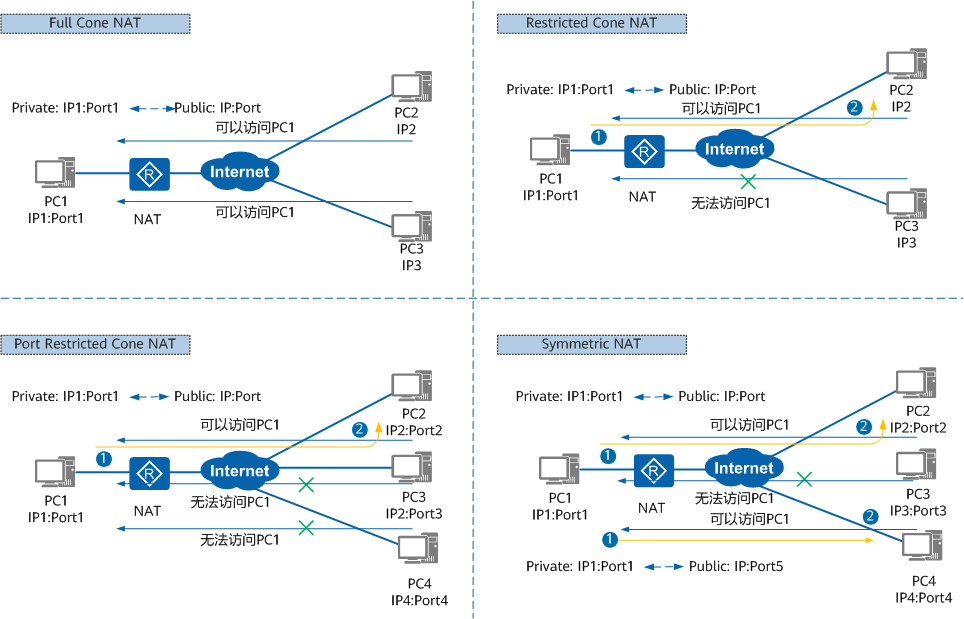

# NAT

## NAT是什么

- NAT是一种地址转换技术，它可以将IP数据报文头中的IP地址转换为另一个IP地址，并通过转换端口号达到地址重用的目的。NAT作为一种缓解IPv4公网地址枯竭的过渡技术，由于实现简单，得到了广泛应用。

## NAT解决的问题

- 随着网络应用的增多，IPv4地址枯竭的问题越来越严重。尽管IPv6可以从根本上解决IPv4地址空间不足问题，但目前众多网络设备和网络应用大多是基于IPv4的，因此在IPv6广泛应用之前，使用一些过渡技术（如CIDR、私网地址等）是解决这个问题的主要方式，NAT就是这众多过渡技术中的一种。

- 当私网用户访问公网的报文到达网关设备后，如果网关设备上部署了NAT功能，设备会将收到的IP数据报文头中的IP地址转换为另一个IP地址，端口号转换为另一个端口号之后转发给公网。在这个过程中，设备可以用同一个公网地址来转换多个私网用户发过来的报文，并通过端口号来区分不同的私网用户，从而达到地址复用的目的。

- 早期的NAT是指Basic NAT，Basic NAT在技术上实现比较简单，只支持地址转换，不支持端口转换。因此，Basic NAT只能解决私网主机访问公网问题，无法解决IPv4地址短缺问题。后期的NAT主要是指网络地址端口转换NAPT（Network Address Port Translation），NAPT既支持地址转换也支持端口转换，允许多台私网主机共享一个公网IP地址访问公网，因此NAPT才可以真正改善IP地址短缺问题。

## NAT的分类

根据NAT转换是对报文中的源地址进行转换还是对目的地址进行转换，NAT可以分为源NAT、目的NAT和双向NAT，下面我们分别介绍这三种NAT类型。

### 源NAT

- 源NAT在NAT转换时，仅对报文中的源地址进行转换，主要应用于私网用户访问公网的场景。当私网用户主机访问Internet时，私网用户主机发送的报文到达NAT设备后，设备通过源NAT技术将报文中的私网IPv4地址转换成公网IPv4地址，从而使私网用户可以正常访问Internet。
- 根据转换时是否同时转换源端口号，源NAT可以细分为如下几种类型，详见下图。

  

### 目的NAT

目的NAT在NAT转换时，仅对报文中的目的地址和目的端口号进行转换，主要应用于公网用户访问私网服务的场景。当公网用户主机发送的报文到达NAT设备后，设备通过目的NAT技术将报文中的公网IPv4地址转换成私网IPv4地址，从而使公网用户可以使用公网地址访问私网服务。

根据转换前后的地址是否存在一种固定的映射关系，目的NAT可以细分为如下几种类型，详见下图。

### 双向NAT

双向NAT指的是在转换过程中同时转换报文的源信息和目的信息。双向NAT不是一个单独的功能，而是源NAT和目的NAT的组合。双向NAT是针对同一条流，在其经过设备时同时转换报文的源地址和目的地址。双向NAT主要应用在同时有外网用户访问内部服务器和私网用户访问内部服务器的场景。

### STUN中定义的NAT类型

在STUN标准中，根据私网IP地址和端口到NAT出口的公网IP地址和端口的映射方式，把NAT分为如下四种类型，详见下图。

- Full Cone NAT（完全锥型NAT）

    所有从同一个私网IP地址和端口（IP1:Port1）发送过来的请求都会被映射成同一个公网IP地址和端口（IP:Port）。并且，任何外部主机通过向映射的公网IP地址和端口发送报文，都可以实现和内部主机进行通信。

    这是一种比较宽松的策略，只要建立了私网IP地址和端口与公网IP地址和端口的映射关系，所有的Internet上的主机都可以访问该NAT之后的主机。

- Restricted Cone NAT（限制锥型NAT）

    所有从同一个私网IP地址和端口（IP1:Port1）发送过来的请求都会被映射成同一个公网IP和端口号（IP:Port）。与完全锥型NAT不同的是，当且仅当内部主机之前已经向公网主机发送过报文，此时公网主机才能向私网主机发送报文。

- Port Restricted Cone NAT（端口限制锥型NAT）

    与限制锥型NAT很相似，只不过它包括端口号。也就是说，一台公网主机（IP2:Port2）想给私网主机发送报文，必须是这台私网主机先前已经给这个IP地址和端口发送过报文。

- Symmetric NAT（对称NAT）

    所有从同一个私网IP地址和端口发送到一个特定的目的IP地址和端口的请求，都会被映射到同一个IP地址和端口。如果同一台主机使用相同的源地址和端口号发送报文，但是发往不同的目的地，NAT将会使用不同的映射。此外，只有收到数据的公网主机才可以反过来向私网主机发送报文。

    这和端口限制锥型NAT不同，端口限制锥型NAT是所有请求映射到相同的公网IP地址和端口，而对称NAT是不同的请求有不同的映射。

## NAT是如何工作的？

根据前面的分类，我们分别从源NAT和目的NAT中各选一种NAT为代表，介绍其工作原理。其他类型的NAT虽然在转换时，转换的内容有细微差别，但是工作原理都相似，不再重复介绍。此外，双向NAT是源NAT和目的NAT的组合，双向NAT的工作原理也不再重复介绍。

### NAPT工作原理

NAPT在进行地址转换的同时还进行端口转换，可以实现多个私网用户共同使用一个公网IP地址上网。NAPT根据端口来区分不同用户，真正做到了地址复用。

当Host访问Web Server时，设备的处理过程如下：

- 设备收到Host发送的报文后查找NAT策略，发现需要对报文进行地址转换。
- 设备根据源IP Hash算法从NAT地址池中选择一个公网IP地址，替换报文的源IP地址，同时使用新的端口号替换报文的源端口号，并建立会话表，然后将报文发送至Internet。
- 设备收到Web Server响应Host的报文后，通过查找会话表匹配到步骤2中建立的表项，将报文的目的地址替换为Host的IP地址，将报文的目的端口号替换为原始的端口号，然后将报文发送至Intranet。
  
### NAT Server工作原理

使用NAT Server时，需要先在设备上配置公网地址和私网地址的固定映射关系。配置完成后，设备将会生成Server-Map表项，存放公网地址和私网地址的映射关系。该表项将一直存在除非NAT Server的配置被删除。

内部Server的私网IPv4地址为192.168.1.2/24，对外的公网IPv4地址为1.1.1.10，端口号都为80，它们之间的映射关系在设备上已提前配置好。当Host访问Server时，设备的处理过程如下：

- 设备收到Internet上用户访问1.1.1.10的报文的首包后，查找并匹配到Server-Map表项，将报文的目的IP地址转换为192.168.1.2。

- 设备建立会话表，然后将报文发送至Intranet。

- 设备收到Server响应Host的报文后，通过查找会话表匹配到步骤2中建立的表项，将报文的源地址替换为1.1.1.10，然后将报文发送至Internet。

- 后续Host继续发送给Server的报文，设备都会直接根据会话表项的记录对其进行转换，而不会再去查找Server-map表项。
  