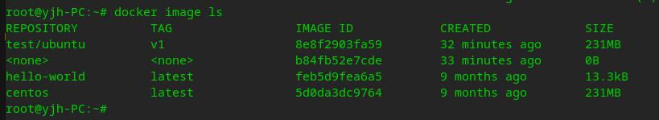

# docker学习笔记

## 基本概念

- 镜像（Image）：Docker 镜像（Image），就相当于是一个 root 文件系统。比如官方镜像 ubuntu:16.04 就包含了完整的一套 Ubuntu16.04 最小系统的 root 文件系统。
  - 类似于虚拟机中的镜像，是一个包含有文件系统的面向Docker引擎的只读模板。任何应用程序运行都需要环境，而镜像就是用来提供这种运行环境的。例如一个Ubuntu镜像就是一个包含Ubuntu操作系统环境的模板，同理在该镜像上装上Apache软件，就可以称为Apache镜像。  

- 容器（Container）：镜像（Image）和容器（Container）的关系，就像是面向对象程序设计中的类和实例一样，镜像是静态的定义，容器是镜像运行时的实体。容器可以被创建、启动、停止、删除、暂停等。
  - 类似于一个轻量级的沙盒，可以将其看作一个极简的Linux系统环境（包括root权限、进程空间、用户空间和网络空间等），以及运行在其中的应用程序。Docker引擎利用容器来运行、隔离各个应用。容器是镜像创建的应用实例，可以创建、启动、停止、删除容器，各个容器之间是是相互隔离的，互不影响。注意：镜像本身是只读的，容器从镜像启动时，Docker在镜像的上层创建一个可写层，镜像本身不变。
  
- 仓库（Repository）：类似于代码仓库，这里是镜像仓库，是Docker用来集中存放镜像文件的地方。注意与注册服务器（Registry）的区别：注册服务器是存放仓库的地方，一般会有多个仓库；而仓库是存放镜像的地方，一般每个仓库存放一类镜像，每个镜像利用tag进行区分，比如Ubuntu仓库存放有多个版本（12.04、14.04等）的Ubuntu镜像。

## docker 启动与停止

- 启动docker
  > sudo service docker start

- 重启docker
  > sudo service docker restart

- 停止docker
  > sudo service docker stop

## 镜像操作

### 1. 镜像列表

 >sudo docker image ls  

> REPOSITORY：镜像所在的仓库名称  
> TAG：镜像标签  
> IMAGEID：镜像ID  
> CREATED：镜像的创建日期(不是获取该镜像的日期)  
> SIZE：镜像大小

### 2. 从仓库拉取镜像

#### 官方镜像

> sudo docker image pull 镜像名称 或者 sudo docker image pull library/镜像名称  
> sudo docker image pull ubuntu 或者 sudo docker image pull library/ubuntu  
> sudo docker image pull ubuntu:16.04  
>或者 sudo docker image pull library/  ubuntu:16.04

#### 个人镜像

> sudo docker image pull 仓库名称/镜像名称  
> sudo docker image pull tuling/fastdfs

### 3. 删除镜像

>sudo docker image rm 镜像名或镜像ID

## 4. Docker容器操作

### 1. docker容器列表

 查看正在运行的容器
> sudo docker container ls  

查看所有的容器
> sudo docker container ls --all / -a

### 2 创建容器

> sudo docker run [option] 镜像名 [向启动容器中传入的命令]  
>常用可选参数说明：  
> -i 表示以《交互模式》运行容器。  
> -t 表示容器启动后会进入其命令行。加入这两个参数后，容器创建就能登录进去。即分配一个伪终端。  
> --name 为创建的容器命名。  
> -v 表示目录映射关系，即宿主机目录:容器中目录。注意:最好做目录映射，在宿主机上做修改，然后共享到容器上。  
> -d 会创建一个守护式容器在后台运行(这样创建容器后不会自动登录容器)。  
> -p 表示端口映射，即宿主机端口:容器中端口。  
> --network=host 表示将主机的网络环境映射到容器中，使容器的网络与主机相同。  

### 3. 交互式容器

>sudo docker run -it --name=ubuntu1 ubuntu /bin/bash  
>在容器中可以随意执行linux命令，就是一个ubuntu的环境。  
>当执行 exit 命令退出时，该容器随之停止。

### 4. 守护式容器

> 开启守护式容器  
> sudo docker run -dit --name=ubuntu2 ubuntu

### 5. 停止和启动容器

>停止容器
>sudo docker container stop 容器名或容器id  
> kill掉容器  
> sudo docker container  
> kill 容器名或容器id  
> 启动容器  
> sudo docker container start 容器名或容器id

### 6. 删除容器

>sudo docker container rm 容器名或容器id

### 7. 容器制作成镜像

将容器制作成镜像
>sudo docker commit 容器名 镜像名  

镜像打包备份
>sudo docker save -o 保存的文件名 镜像名

镜像压缩
>sudo docker load -i 文件路径/备份文件
