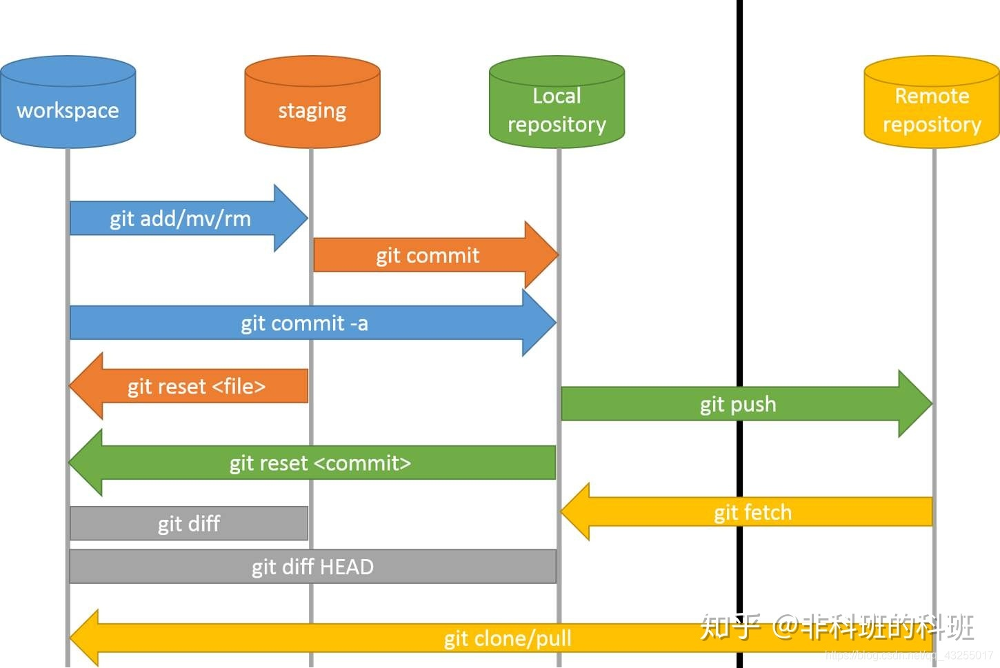
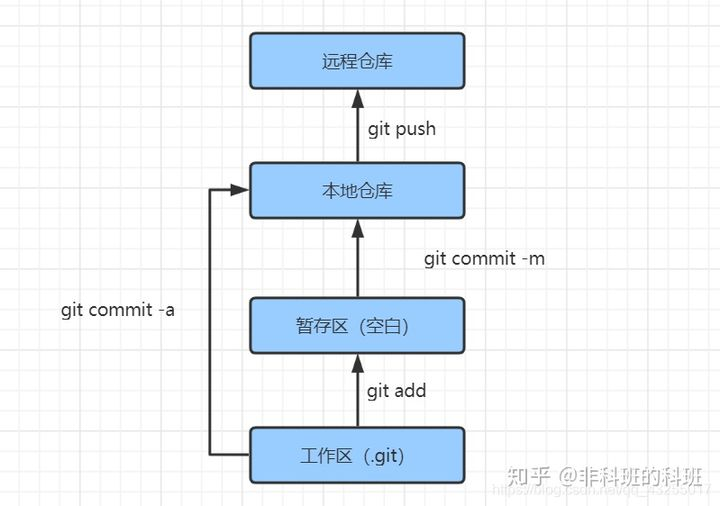
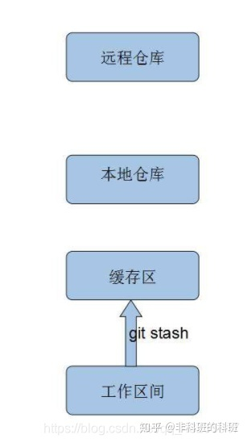

# git和svn

## 1、 git原理

分布式版本控制  
远程仓库、工作区、暂存区、版本库  

  
初始化的时候Git还会自动为我们创建第一个分支master，以及指向master的一个指针叫做HEAD。

***

## 2、git初始化

>生成秘钥（~/.ssh/id_rsa.pub将公钥复制到远程）  
>ssh-keygen -t rsa -C <mail> -f  gitee_nanlh_ras

>忽略权限  
>git config core.fileMode false

>已跟踪文件忽略修改
>git update-index --assume-unchanged <file>  
>git ls-files -m | xargs git update-index --assume-unchanged   

>已跟踪文件取消忽略修改  
>git update-index --no-assume-unchanged <file>  
>git ls-files -v | grep '^h' | awk '{print $2}' | xargs git update-index --no-assume-unchanged  

>未跟踪文件忽略修改  
>git status -u | grep $'\t' | sed 's/^[\t]//g' >> .gitignore

***
## 3、克隆项目

>git clone http://...

***
## 4、提交代码
- >`git add .`：文件添加进暂存区。  
- >`git commit -m "提交信息"`：文件添加进本地仓库，-m参数改为-am可以直接推向本地仓库。  
- >`git push`：文件推向远程仓库。
- >运行git commit -a相当于运行git add把所有文件加入暂存区，然后再运行git commit把文件提交本地仓库。  

commit的本质就是：「每次Git都会用暂存区的文件创建一个新的提交，把当前的分支指向新的提交节点，这样就完成了一次新的提交」：  
若是HEAD指针指向的是bran分支，那么新的节点就会成为jh509的子节点，并且形成新的分支：

***
## 5、代码回退

那么从高level向低level移动代码的命令如下：

- >`git pull`：从远程仓库拉取代码到本地。  
- >`git reset --files`：用本地仓库覆盖暂存区中修改，也就是覆盖最后一次git add的内容。  
- >`git checkout --files`：把文件从暂存区复制到工作区，用于放弃本地的修改。
- >`git checkout HEAD --files`：回退最后一次的提交内容。  

## 6、切换分支
- ### 创建
  新建分支的实质：「就是新建立一个引用，指向当前提交，master就好比一个引用」；切换分支的实质：就是将HEAD由指向原来的引用，重新指向要切换的分支的引用上：
  >`git branch <branch-name>		` 创建分支  
  >`git checkout <branch-name>		` 切换分支  
  >`git checkout -b <branch-name>		`创建并切换  

- >### 上传
  >`git push origin <branch-name>	` 将分支推送到远程  
  >`git push origin --set-upstream <branch-name>  

- >### 删除
  >`git push origin :<branch-name>	`删除远程仓库分支  
  >`git push -d origin <branch-name>  `

- >### 合并
  >#### 分支合并方法1
  >`git checkout develop`
  >`git merge patch_20200601`
  >#### 分支合并方法2（创造更线性的提交历史） 
  >`git checkout patch_20200601`
  >`git rebase develop`
  >`git checkout develop`
  >`git rebase patch_20200601`

- >### 同步其他分支修改
>`git cherry-pick <hashID>`
>`git cherry-pick A^..B 		`	A-B的提交合并到当前分支
***

## 7、查看修改
  difftool（bcompare查看修改）
   >git difftool -y <file>   
   >git difftool --no-symlinks -d  
   >git difftool --no-symlinks -d <hashID> <hashID>

push的本质：「就是用你本地仓库的commit记录去覆盖远程仓库的commit记录」。  
但是别人提交了一些代码，而你本地并没有这些代码，这样代码就会被覆盖，导致别人的commit的记录就不存在，这个是绝对不允许的。  

所以，每次push的时候Git就会检查，若是存在这种情况就是push失败，只要先git pull一下，将本地仓库与远程仓库先合并一下，最后push就可以成功了，若是文件中已经存在在冲突代码，只要打开文件重新解决一下冲突即可。  

mergetool（bcompare解决冲突）
   >git mergetool

***
## 8、临时存取工作区的改动
某一时刻你想把当前的改动临时进行存放起来，可以使用git stash命令，它表示将改动的文件存储到一个独立的存储区域，并不会被提交，当再次需要的时候可以随时取出来。

这里要注意的是：「git stash的是改动的文件，也就是被Git追踪的文件，新添加的文件并没有被Git追踪，所以git stash并不会stash」。

git stash命令也可以加上save命令后面再加上备注信息，方便查看：
>git stash save "备注信息"

git stash成功后「本地的工作目录的代码会和本地仓库一样」，git stash后可以通过git stash list命令查看之前stash的历史记录，当再次需要将改动的文件取出来时候，可以通过以下命令：
>git stash pop

# SVN 

## 概念
  SVN（Apache Subversion）是一个开源的版本控制系统。
一个集中式的文件管理系统，服务器会记住每一个文件的每一次变动，或是浏览文件的变动历史。

##下载代码
>svn co http://..

##查看修改
>svn st ./  
>svn diff ./README.md

## 提交修改
>svn ci -m “[1.all] [修改] [模块] [描述] [测试建议] [自测内容] [检视人]”

## 添加到版本控制
>svn add ./README.md  
>svn add --no-ignore （取消自动忽略.so等文件，上传SDK时一定要加该参数）

## 更新代码
>svn up（更新到最新）   svn up -r111（回滚r111）

## 提交还原
>svn merge -r 7876:7875 ./ （把r7876修改的内容还原）

## svn log
>svn log -r 7876 -v      某个版本日志  
>svn diff -r 7875:7876   比较两个版本
>snv log -l 10           查看近10条日志

## SVN客户端
>smartSVN  
>TortoiseSVN

# Git 对比 SVN

## Git是分布式的，SVN是集中式的  
这是 Git 和 SVN 最大的区别。若能掌握这个概念，两者区别基本搞懂大半。因为 Git 是分布式的，所以 Git 支持离线工作，在本地可以进行很多操作，包括接下来将要重磅推出的分支功能。而 SVN 必须联网才能正常工作。  

## Git复杂概念多，SVN简单易上手
所有同时掌握 Git 和 SVN 的开发者都必须承认，Git 的命令实在太多了，日常工作需要掌握add,commit,status,fetch,push,rebase等，若要熟练掌握，还必须掌握rebase和merge的区别，fetch和pull的区别等，除此之外，还有cherry-pick，submodule，stash等功能，仅是这些名词听着都很绕。  

在易用性这方面，SVN 会好得多，简单易上手，对新手很友好。但是从另外一方面看，Git 命令多意味着功能多，若我们能掌握大部分 Git 的功能，体会到其中的奥妙，会发现再也回不去 SVN 的时代了。  

## Git分支廉价，SVN分支昂贵
在版本管理里，分支是很常使用的功能。在发布版本前，需要发布分支，进行大需求开发，需要 feature 分支，大团队还会有开发分支，稳定分支等。在大团队开发过程中，常常存在创建分支，切换分支的需求。  

Git 分支是指针指向某次提交，而 SVN 分支是拷贝的目录。这个特性使 Git 的分支切换非常迅速，且创建成本非常低。

而且 Git 有本地分支，SVN 无本地分支。在实际开发过程中，经常会遇到有些代码没写完，但是需紧急处理其他问题，若我们使用 Git，便可以创建本地分支存储没写完的代码，待问题处理完后，再回到本地分支继续完成代码。

