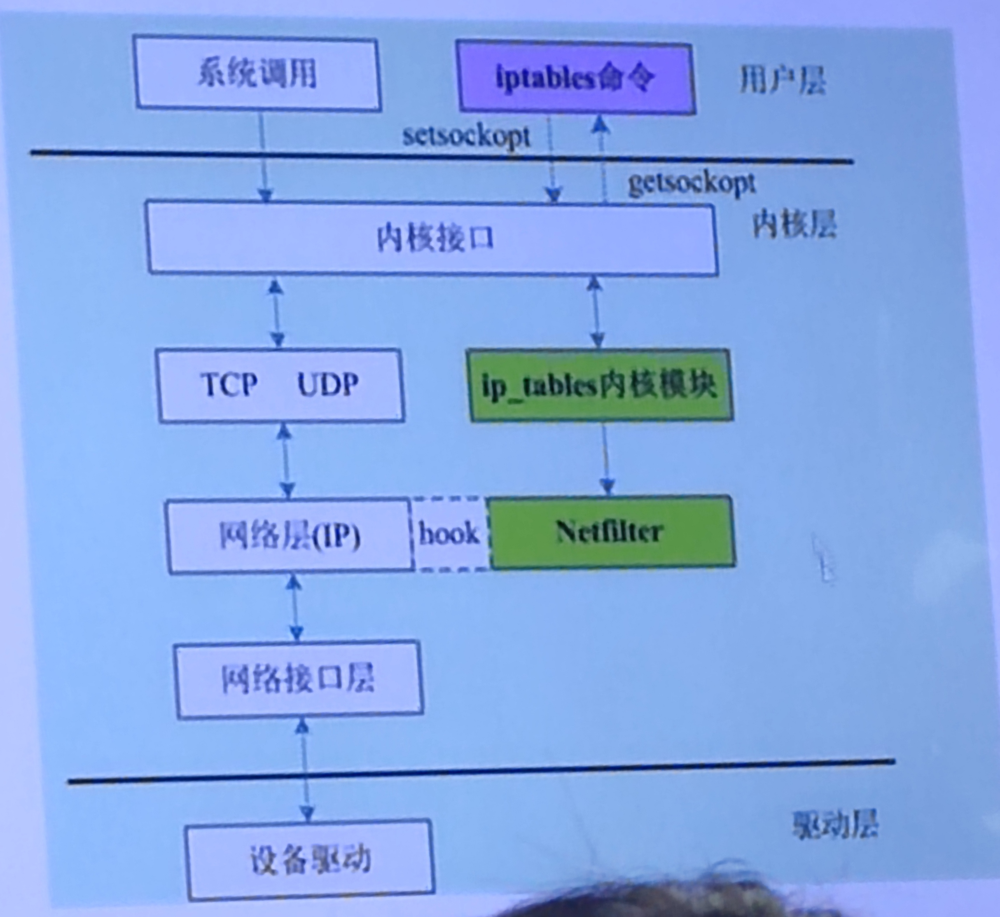
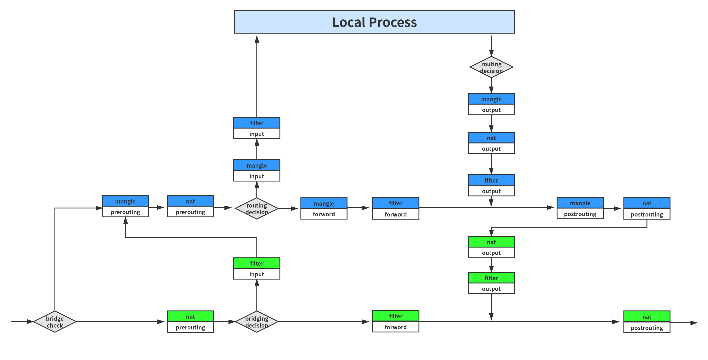

# iptables 学习笔记

## iptables 基本知识

### iptables 工作基础

iptables其实是一个命令行工具，位于用户空间，我们用这个工具操作真正的框架。

iptables其实不是真正的防火墙，我们可以把它理解成一个客户端代理，用户通过iptables这个代理，将用户的安全设定执行到对应的”安全框架”中，这个”安全框架”才是真正的防火墙，这个框架的名字叫netfilter

netfilter才是防火墙真正的安全框架（framework），netfilter位于内核空间。  
Netfilter是Linux操作系统核心层内部的一个数据包处理模块，它具有如下功能：

- 网络地址转换(Network Address Translate)
- 数据包内容修改
- 以及数据包过滤的防火墙功能

所以说，虽然我们使用service iptables start启动iptables”服务”，但是其实准确的来说，iptables并没有一个守护进程，所以并不能算是真正意义上的服务，而应该算是内核提供的功能。

### iptables 链的概念

报文通过时，防火墙会以相关规则对报文进行匹配，然后执行“动作”，而关卡上的规则可能不止一个，而将所有规则串在一起就形成了链。

### 表的概念

把具有相同功能的规则的集合叫做”表”，所以说，不同功能的规则，我们可以放置在不同的表中进行管理，而iptables已经为我们定义了4种表，每种表对应了不同的功能，而我们定义的规则也都逃脱不了这4种功能的范围，所以，学习iptables之前，我们必须先搞明白每种表 的作用。

iptables为我们提供了如下规则的分类，或者说，iptables为我们提供了如下”表”

- filter表：负责过滤功能，防火墙；内核模块：iptables_filter
- nat表：network address translation，网络地址转换功能；内核模块：iptable_nat
- mangle表：拆解报文，做出修改，并重新封装 的功能；iptable_mangle
- raw表：关闭nat表上启用的连接追踪机制；iptable_raw

### 链表关系

链的规则存放于哪些表中（从链到表的对应关系）：

|链||表|
|---|---|---|
|PREROUTING  | 的规则可以存在于：|raw表，mangle表，nat表。
|INPUT       | 的规则可以存在于：|mangle表，filter表，（centos7中还有nat表，centos6中没有）。
|FORWARD     | 的规则可以存在于：|mangle表，filter表。
|OUTPUT      |的规则可以存在于： |raw表mangle表，nat表，filter表
|POSTROUTING | 的规则可以存在于：|mangle表，nat表。

|表（功能）| 表中的规则可以被哪些链使用 |链（钩子）|
|---|---|---|
|raw||PREROUTING，OUTPUT
|mangle | |PREROUTING，INPUT，FORWARD，OUTPUT，POSTROUTING
|nat | |PREROUTING，OUTPUT，POSTROUTING（centos7中还有INPUT，centos6中没有）
|filter || INPUT，FORWARD，OUTPUT

iptables为我们定义了4张”表”,当他们处于同一条”链”时，执行的优先级如下。

优先级次序（由高而低）：

- raw –> mangle –> nat –> filter

但是我们前面说过，某些链天生就不能使用某些表中的规则，所以，4张表中的规则处于同一条链的目前只有output链

### 数据流程

### 规则的概念

规则：根据指定的匹配条件来尝试匹配每个流经此处的报文，一旦匹配成功，则由规则后面指定的处理动作进行处理；

那么我们来通俗的解释一下什么是iptables的规则，之前打过一个比方，每条”链”都是一个”关卡”，每个通过这个”关卡”的报文都要匹配这个关卡上的规则，如果匹配，则对报文进行对应的处理，比如说，你我二人此刻就好像两个”报文”，你我二人此刻都要入关，可是城主有命，只有器宇轩昂的人才能入关，不符合此条件的人不能入关，于是守关将士按照城主制定的”规则”，开始打量你我二人，最终，你顺利入关了，而我已被拒之门外，因为你符合”器宇轩昂”的标准，所以把你”放行”了，而我不符合标准，所以没有被放行，其实，”器宇轩昂”就是一种”匹配条件”，”放行”就是一种”动作”，”匹配条件”与”动作”组成了规则。

规则由匹配条件和处理动作组成。

#### 匹配条件

匹配条件分为基本匹配条件与扩展匹配条件

- 基本匹配条件：  
源地址Source IP，目标地址 Destination IP

上述内容都可以作为基本匹配条件。  

除了上述的条件可以用于匹配，还有很多其他的条件可以用于匹配，这些条件泛称为扩展条件，这些扩展条件其实也是netfilter中的一部分，只是以模块的形式存在，如果想要使用这些条件，则需要依赖对应的扩展模块

- 扩展匹配条件：  
    源端口Source Port, 目标端口Destination Port

上述内容都可以作为扩展匹配条件

#### 处理动作

处理动作在iptables中被称为target（这样说并不准确，我们暂且这样称呼），动作也可以分为基本动作和扩展动作。

此处列出一些常用的动作，之后的文章会对它们进行详细的示例与总结：

- ACCEPT：允许数据包通过。

- DROP：直接丢弃数据包，不给任何回应信息，这时候客户端会感觉自己的请求泥牛入海了，过了超时时间才会有反应。

- REJECT：拒绝数据包通过，必要时会给数据发送端一个响应的信息，客户端刚请求就会收到拒绝的信息。

- SNAT：源地址转换，解决内网用户用同一个公网地址上网的问题。

- MASQUERADE：是SNAT的一种特殊形式，适用于动态的、临时会变的ip上。

- DNAT：目标地址转换。

- REDIRECT：在本机做端口映射。

- LOG：在/var/log/messages文件中记录日志信息，然后将数据包传递给下一条规则，也就是说除了记录以外不对数据包做任何其他操作，仍然让下一条规则去匹配。

### 规则查询

查看对应表的所有规则:
> iptables -t 表名 -L  
>-t选项指定要操作的表，省略”-t 表名”时，默认表示操作filter表，-L表示列出规则，即查看规则。

查看指定表的指定链中的规则。
>iptables -t 表名 -L 链名

查看指定表的所有规则，并且显示更详细的信息（更多字段）

>iptables -t 表名 -v -L  
-v表示verbose，表示详细的，冗长的，当使用-v选项时，会显示出”计数器”的信息，由于上例中使用的选项都是短选项，所以一般简写为iptables -t 表名 -vL

查看表的所有规则
>iptables -t 表名 -n -L  
在显示规则时，不对规则中的IP或者端口进行名称反解，-n选项表示不解析IP地址。

查看表的所有规则，并且显示规则的序号
>iptables --line-numbers -t 表名 -L  
–line-numbers选项表示显示规则的序号，注意，此选项为长选项，不能与其他短选项合并，不过此选项可以简写为–line，注意，简写后仍然是两条横杠，仍然是长选项。

表示查看表中的所有规则，并且显示更详细的信息(-v选项)，不过，计数器中的信息显示为精确的计数值，而不是显示为经过可读优化的计数值
>iptables -t 表名 -v -x -L  
  x选项表示显示计数器的精确值。

实际使用中，为了方便，往往会将短选项进行合并，所以，如果将上述选项都糅合在一起，可以写成如下命令，此处以filter表为例。

>iptables --line -t filter -nvxL  

当然，也可以只查看某张表中的某条链，此处以filter表的INPUT链为例

>iptables --line -t filter -nvxL INPUT

### 增加规则

-t选项指定了要操作的表，此处指定了操作filter表，与之前的查看命令一样，不使用-t选项指定表时，默认为操作filter表。

-I选项，指明将”规则”插入至哪个链中，-I表示insert，即插入的意思，所以-I INPUT表示将规则插入于INPUT链中，即添加规则之意，并且在表头。添加规则时，指定新增规则的编号，这样我们就能在任意位置插入规则，-I INPUT 2 表示在INPUT链中新增规则，新增的规则的编号为2。

-s选项，指明”匹配条件”中的”源地址”，即如果报文的源地址属于-s对应的地址，那么报文则满足匹配条件，-s为source之意，表示源地址。

-j选项，指明当”匹配条件”被满足时，所对应的动作，上例中指定的动作，比如ROP、ACCEPT。

-A为append之意，所以，-A INPUT则表示在INPUT链中追加规则，而之前示例中使用的-I选项则表示在链中”插入规则”，聪明如你一定明白了，它们的本意都是添加一条规则，只是-A表示在链的尾部追加规则，-I表示在链的首部插入规则而已。

### 删除规则

删除所有规则：
> iptables -t 表名 -F 链名  
>-F选项为flush之意，即冲刷指定的链，即删除指定链中的所有规则，但是注意，此操作相当于删除操作，在没有保存iptables规则的情况下，请慎用。

删除表中INPUT中的一条规则，有两种办法:

1. 根据规则的编号去删除规则

>iptables -t filter -D INPUT 3

1. 根据具体的匹配条件与动作删除规则  

>iptables -t filter -D INPUT -s 172.16.112.1 -j ACCEPT

### 修改规则

注意点：如果使用-R选项修改规则中的动作，那么必须指明原规则中的原匹配条件，例如源IP，目标IP等。

修改指定表中指定链的指定规则，-R选项表示修改对应链中的规则，使用-R选项时要同时指定对应的链以及规则对应的序号，并且规则中原本的匹配条件不可省略。

> 命令语法：iptables -t 表名 -R 链名 规则序号 规则原本的匹配条件 -j 动作  
示例：iptables -t filter -R INPUT 3 -s 192.168.1.146 -j ACCEPT  
上述示例表示修改filter表中INPUT链的第3条规则，将这条规则的动作修改为ACCEPT， -s 192.168.1.146为这条规则中原本的匹配条件，如果省略此匹配条件，修改后的规则中的源地址可能会变为0.0.0.0/0。

其他修改规则的方法：先通过编号删除规则，再在原编号位置添加一条规则。

修改指定表的指定链的默认策略（默认动作），并非修改规则，可以使用如下命令。

>命令语法：iptables -t 表名 -P 链名 动作  
示例：iptables -t filter -P FORWARD ACCEPT  
上例表示将filter表中FORWARD链的默认策略修改为ACCEPT

### 保存规则

保存规则命令如下，表示将iptables规则保存至/etc/sysconfig/iptables文件中，如果对应的操作没有保存，那么当重启iptables服务以后

>service iptables save  

注意点：centos7中使用默认使用firewalld，如果想要使用上述命令保存规则，需要安装iptables-services，具体配置过程请回顾上文。

或者使用如下方法保存规则

>iptables-save > /etc/sysconfig/iptables  

可以使用如下命令从指定的文件载入规则，注意：重载规则时，文件中的规则将会覆盖现有规则。

>iptables-restore < /etc/sysconfig/iptables
