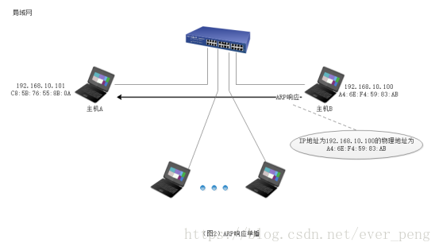
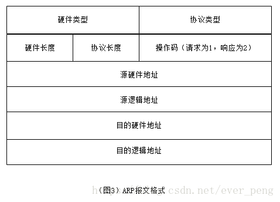
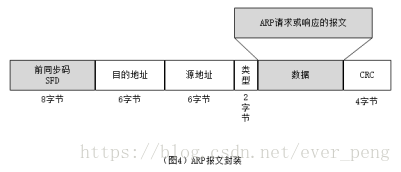
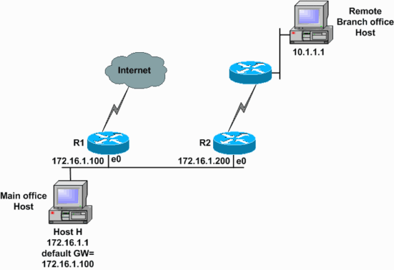
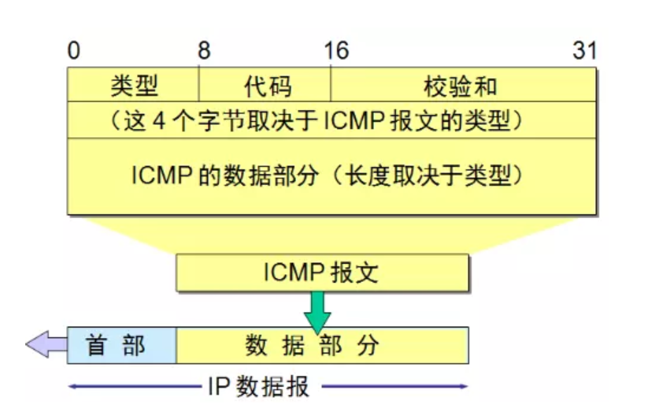
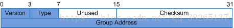
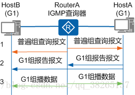
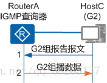
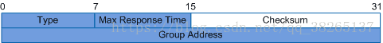

# 计算机网络

## 五层架构示意图

由下到上的顺序为：1、物理层；2、数据链路层；3、网络层；4、运输层（传输层）5、应用层

## 基本概念阐述

### 物理层

    在物理层上所传数据的单位是比特(bit)。发送方发送1或者0时，接收方应该接收相同的1或者0，因此物理层要考虑用多大的电压代表"1"或者"0", 以及接收方如何识别发送方所发出的比特。物理层还要确定连接电缆的插头应当有多少根引脚以及各引脚如何连接。当然解释比特代表的意思，就不是物理层的任务。请注意，传递信息所利用的一些物理媒体，如双绞线、同轴电缆、光缆、无线信道等，并不是物理层协议之内而是在物理层 协议的下面。因此也有人把物理层当做第0层。 

### 数据链路层

    数据链路层通常简称为链路层。我们知道，两台主机之间的数据传输，总是在一段一段的链路上传送的, 这就需要使用专门的链路层的协议。在两个相邻结点之间传送数据时，数据链路层量网络层交下来的IP数据报封装成帧(frameing),在两个相邻节点间的链路上传送帧, 每一帧包括数据和必要的控制信息(如同步信息、地址信息、差错信息等)。

    在接收数据时，控制信息使接收端能够知道一个帧从哪个比特开始到哪个比特结束，这样数据链路层在收到一个帧后，就可从中提取数据部分，上交到网络层。

    控制信息还能使接收端能够检测到所收到的帧中有无差错。如发现有差错，数据链路层就简单的丢弃了这个出了差错的帧，以免继续在网络传输下去白白的浪费资源。如果需要改正数据在数据链路层传输时出现的差错(这就是说,数据链路层不仅要检错,还要纠错)， 那么就可以采用可靠数据传输协议来纠正出现的差错。这种方法会使数据链路层的协议复杂些。

### 网络层

    网络层负责为分组交换网上的不同主机提供通信服务。

    在发送数据时，网络层吧运输层产生的报文段或者用户数据报封装成分组或者包进行传送。在TCP/IP体系中，由于网络层使用IP协议，因此分组也叫作IP数据报，或简称数据报。
    请注意：不要将运输层的"用户数据报UDP"和网络层的"IP数据报"弄混，此外，无论哪一层传输的数据单元，都可以笼统的用"分组"来表示。
    网络层的另一个任务就是选择合适的路由，是源主机运输层所传下来的分组，能够通过网络中的路由器来找到目的主机。

    互联网是有大量的异构(heterogeneous)网络来通过路由器(Router)相互连接起来的。互联网使用的网络层协议是无连接的网际协议IP(Internet Protocol)和许多路由选择协议, 因此互联网的网络层也叫作网际层或IP层。 

### 运输层

    运输层的任务就是负责向两台主机中进程之间的通信提供通用的数据传输服务。应用进程利用该服务穿上那个应用层报文。所谓通用的，是指并不针对某个特定网路应用，而是多种应用可以使用同一个运输层服务。由于一台主机可以同时运行多个进程，因此运输层有复用和分用的功能。复用就是多个应用层进程可同时使用下面运输层的服务，分用和复用相反，是运输层把收到的信息分别交付给上面应用层的相关进程。

    运输层主要有下面两种协议：

    传输控制协议TCP(Transmission Control Protocol)-提供面向连接的、可靠的数据传输服务，其数据传输的单位是报文段(segment)。
    用户数据报协议 UDP(User Datagram)。 Protocol)-提供无连接的、尽最大努力(best-effort)的数据传输服务(不保证数据传输的可靠性),其数据传输的单位是用户数据报。
    顺便指出，有人原意把运输层称为传输层，理由是这一层使用的TCP协议就叫做传输控制协议。从意思上看，传输和运输差别也不大，但OSI定义的第四层使用的是Transport，而不是Transmission。这两个字的含义还是有些差别。因此，使用运输层这个译名比较准确。

### 应用层

    应用层是体系结构中的最高层。应用层的任务是通过应用进程间的交互来完成特定网络应用。应用层协议定义的是应用进程间通信和交互的规则。这里的进程就是主机中正在运行的程序。对于不听的网络应用需要不有不同的应用层协议。在互联网的应用层协议很多，如域名DNS，支持万维网应用的HTTP协议，支持电子邮件的SMTP协议，等等。我们把应用层的数据单元称为报文(messgae)。

## 数据流程

根据箭头方向重点关注：1、主机1是发送方，主机2是接收方； 2、 数据在主机1内部自上而下，在每层都加上了本层的协议头部；而到了对端主机2 接收的时候，自下而上的剥离本层的头部；3、横向看每一层数据的格式基本是相同的。

## 相关协议

### ARP

    ARP协议是“Address Resolution Protocol”（地址解析协议）的缩写。其作用是在以太网环境中，数据的传输所依懒的是MAC地址而非IP地址，而将已知IP地址转换为MAC地址的工作是由ARP协议来完成的。

    在局域网中，网络中实际传输的是“帧”，帧里面是有目标主机的MAC地址的。在以太网中，一个主机和另一个主机进行直接通信，必须要知道目标主机的MAC地址。但这个目标MAC地址是如何获得的呢？它就是通过地址解析协议获得的。所谓“地址解析”就是主机在发送帧前将目标IP地址转换成目标MAC地址的过程。ARP协议的基本功能就是通过目标设备的IP地址，查询目标设备的MAC地址，以保证通信的顺利进行。

#### ARP映射方式

#### 静态映射

    静态映射的意思是要手动创建一张ARP表，把逻辑（IP）地址和物理地址关联起来。这个ARP表储存在网络中的每一台机器上。例如，知道其机器的IP地址但不知道其物理地址的机器就可以通过查ARP表找出对应的物理地址。这样做有一定的局限性，因为物理地址可能发生变化：
    （1）机器可能更换NIC（网络适配器），结果变成一个新的物理地址。
    （2）在某些局域网中，每当计算机加电时，他的物理地址都要改变一次。
    （3）移动电脑可以从一个物理网络转移到另一个物理网络，这样会时物理地址改变。
    要避免这些问题出现，必须定期维护更新ARP表，此类比较麻烦而且会影响网络性能。

#### 动态映射

    动态映射时，每次只要机器知道另一台机器的逻辑（IP）地址，就可以使用协议找出相对应的物理地址。已经设计出的实现了动态映射协议的有ARP和RARP两种。ARP把逻辑（IP）地址映射为物理地址。RARP把物理地址映射为逻辑（IP）地址。

#### ARP原理及流程

    在任何时候，一台主机有IP数据报文发送给另一台主机，它都要知道接收方的逻辑（IP）地址。但是IP地址必须封装成帧才能通过物理网络。这就意味着发送方必须有接收方的物理（MAC）地址，因此需要完成逻辑地址到物理地址的映射。而ARP协议可以接收来自IP协议的逻辑地址，将其映射为相应的物理地址，然后把物理地址递交给数据链路层。

#### ARP请求

    任何时候，当主机需要找出这个网络中的另一个主机的物理地址时，它就可以发送一个ARP请求报文，这个报文包好了发送方的MAC地址和IP地址以及接收方的IP地址。因为发送方不知道接收方的物理地址，所以这个查询分组会在网络层中进行广播。

.png)

#### ARP响应

    局域网中的每一台主机都会接受并处理这个ARP请求报文，然后进行验证，查看接收方的IP地址是不是自己的地址，只有验证成功的主机才会返回一个ARP响应报文，这个响应报文包含接收方的IP地址和物理地址。这个报文利用收到的ARP请求报文中的请求方物理地址以单播的方式直接发送给ARP请求报文的请求方。

#### 报文格式

    硬件类型：16位字段，用来定义运行ARP的网络类型。每个局域网基于其类型被指派一个整数。例如：以太网的类型为1。ARP可用在任何物理网络上。

    协议类型：16位字段，用来定义使用的协议。例如：对IPv4协议这个字段是0800。ARP可用于任何高层协议

    硬件长度：8位字段，用来定义物理地址的长度，以字节为单位。例如：对于以太网的值为6。

    协议长度：8位字段，用来定义逻辑地址的长度，以字节为单位。例如：对于IPv4协议的值为4。

    操作码：16位字段，用来定义报文的类型。已定义的分组类型有两种：ARP请求（1），ARP响应（2）。

    源硬件地址：这是一个可变长度字段，用来定义发送方的物理地址。例如：对于以太网这个字段的长度是6字节。

    源逻辑地址：这是一个可变长度字段，用来定义发送方的逻辑（IP）地址。例如：对于IP协议这个字段的长度是4字节。

    目的硬件地址：这是一个可变长度字段，用来定义目标的物理地址，例如，对以太网来说这个字段位6字节。对于ARP请求报文，这个字段为全0，因为发送方并不知道目标的硬件地址。

    目的逻辑地址：这是一个可变长度字段，用来定义目标的逻辑（IP）地址，对于IPv4协议这个字段的长度为4个字节。

#### ARP报文总长度

    ARP报文的总长度为64字节。

    首先要知道帧的概念 帧是在数据链路层传输的数据格式，比如以太网v2，以太网IEEE802.3和PPP等。

    所以Wireshark抓到的帧是包含帧头的，即包含以太网v2的帧头，长14 bytes；

    而ARP数据包的长度固定为28 bytes；

    帧总长度 = 帧头 + 网络层包头 + 传输层报文头 + 应用数据；

    而ARP请求中ARP包已经是最高层，之上没有传输层和应用层，所以总长度为：

    帧总长度 = 帧头 + ARP包头 = 14 + 28 = 42 bytes；

    而真正 发包的时为了保证以太网帧的最小帧长为64 bytes，会在报文里添加一个padding字段，用来填充数据包大小。

    使用wireshark抓包时，抓到的包为60 bytes。比以太网帧的最小帧长扫了4 bytes，原因是因为wireshark抓包时不能抓到数据包最后的CRC字段。

    CRC字段是为了校验以太网帧的正确性。在数据包填充完成后，回去通过算法计算一个值放到数据包的CRC字段中。当接受端收到数据包后，会同样使用算法计算一个值，然后和CRC字段的值进行对比，查看是否相同。如果不同则证明数据包被更改，如果相同则证明数据包并未被更改。

#### 报文封装

    ARP报文直接封装在数据链路帧中，例如，图4中，ARP分组被封装在以太网的帧中。注意，帧中的类型字段指出此帧所携带的数据是ARP报文。

### ICMP

    ICMP（Internet Control Message Protocol）网际控制报文协议。它是TCP/IP协议簇的一个子协议，用于在IP主机、路由器之间传递控制消息。控制消息是指网络通不通、主机是否可达、路由是否可用等网络本身的消息。这些控制消息虽然并不传输用户数据，但是对于用户数据的传递起着重要的作用。

    ICMP使用IP的基本支持，就像它是一个更高级别的协议，但是，ICMP实际上是IP的一个组成部分，必须由每个IP模块实现。

#### 简介

    ICMP协议是一种面向无连接的协议，用于传输出错报告控制信息。它是一个非常重要的协议，它对于网络安全具有极其重要的意义。它属于网络层协议，主要用于在主机与路由器之间传递控制信息，包括报告错误、交换受限控制和状态信息等。当遇到IP数据无法访问目标、IP路由器无法按当前的传输速率转发数据包等情况时，会自动发送ICMP消息。

    ICMP 是 TCP/IP 模型中网络层的重要成员，与 IP 协议、ARP 协议、RARP 协议及 IGMP 协议共同构成 TCP/IP 模型中的网络层。ping 和 tracert是两个常用网络管理命令，ping 用来测试网络可达性，tracert 用来显示到达目的主机的路径。ping和 tracert 都利用 ICMP 协议来实现网络功能，它们是把网络协议应用到日常网络管理的典型实例。 

    从技术角度来说，ICMP就是一个“错误侦测与回报机制”，其目的就是让我们能够检测网路的连线状况﹐也能确保连线的准确性。当路由器在处理一个数据包的过程中发生了意外，可以通过ICMP向数据包的源端报告有关事件。

    其功能主要有：侦测远端主机是否存在，建立及维护路由资料，重导资料传送路径（ICMP重定向），资料流量控制。ICMP在沟通之中，主要是透过不同的类别(Type)与代码(Code) 让机器来识别不同的连线状况。

    ICMP 是个非常有用的协议﹐尤其是当我们要对网路连接状况进行判断的时候。 

#### 工作原理

    ICMP提供一致易懂的出错报告信息。发送的出错报文返回到发送原数据的设备，因为只有发送设备才是出错报文的逻辑接受者。发送设备随后可根据ICMP报文确定发生错误的类型，并确定如何才能更好地重发失败的数据包。但是ICMP唯一的功能是报告问题而不是纠正错误，纠正错误的任务由发送方完成。

    我们在网络中经常会使用到ICMP协议，比如我们经常使用的用于检查网络通不通的Ping命令（Linux和Windows中均有），这个“Ping”的过程实际上就是ICMP协议工作的过程。还有其他的网络命令如跟踪路由的Tracert命令也是基于ICMP协议的。

#### 报文格式

    ICMP报文包含在IP数据报中，属于IP的一个用户，IP头部就在ICMP报文的前面，所以一个ICMP报文包括IP头部、ICMP头部和ICMP报文，IP头部的Protocol值为1就说明这是一个ICMP报文，ICMP头部中的类型（Type）域用于说明ICMP报文的作用及格式，此外还有一个代码（Code）域用于详细说明某种ICMP报文的类型，所有数据都在ICMP头部后面。

    ICMP报文格式具体由RFC 777 ，RFC 792 规范。

#### ICMP类型

    已经定义的ICMP消息类型大约有10多种，每种ICMP数据类型都被封装在一个IP数据包中。主要的ICMP消息类型包括以下几种。

#### 响应请求

    我们日常使用最多的ping，就是响应请求（Type=8）和应答（Type=0），一台主机向一个节点发送一个Type=8的ICMP报文，如果途中没有异常（例如被路由器丢弃、目标不回应ICMP或传输失败），则目标返回Type=0的ICMP报文，说明这台主机存在，更详细的tracert通过计算ICMP报文通过的节点来确定主机与目标之间的网络距离。

    目标不可到达、源抑制和超时报文
    这三种报文的格式是一样的，目标不可到达报文（Type=3）在路由器或主机不能传递数据报时使用，例如我们要连接对方一个不存在的系统端口（端口号小于1024）时，将返回Type=3、Code=3的ICMP报文，它要告诉我们：“嘿，别连接了，我不在家的！”，常见的不可到达类型还有网络不可到达（Code=0）、主机不可到达（Code=1）、协议不可到达（Code=2）等。源抑制则充当一个控制流量的角色，它通知主机减少数据报流量，由于ICMP没有恢复传输的报文，所以只要停止该报文，主机就会逐渐恢复传输速率。最后，无连接方式网络的问题就是数据报会丢失，或者长时间在网络游荡而找不到目标，或者拥塞导致主机在规定时间内无法重组数据报分段，这时就要触发ICMP超时报文的产生。超时报文的代码域有两种取值：Code=0表示传输超时，Code=1表示重组分段超时。

#### 时间戳

    时间戳请求报文（Type=13）和时间戳应答报文（Type=14）用于测试两台主机之间数据报来回一次的传输时间。传输时，主机填充原始时间戳，接收方收到请求后填充接收时间戳后以Type=14的报文格式返回，发送方计算这个时间差。一些系统不响应这种报文。 

#### 全部消息类型

下表显示了完整的ICMP类型：

#### 应用

    ICMP 协议应用在许多网络管理命令中，下面以 ping 和 tracert 命令为例详细介绍 ICMP 协议的应用。

    （1） ping 命令使用 ICMP 回送请求和应答报文

    在网络可达性测试中使用的分组网间探测命令 ping 能产生 ICMP 回送请求和应答报文。目的主机收到 ICMP 回送请求报文后立刻回送应答报文，若源主机能收到 ICMP 回送应答报文，则说明到达该主机的网络正常。

    （2）路由分析诊断程序 tracert 使用了 ICMP时间超过报文

    tracert 命令主要用来显示数据包到达目的主机所经过的路径。通过执行一个 tracert 到对方主机的命令，返回数据包到达目的主机所经历的路径详细信息，并显示每个路径所消耗的时间。

### IGMP

#### IGMP 简介

    IGMP(Internet Group Management Protocol)互联网组管理协议是TCP/IP 协议族中负责IP组播成员管理的协议，用来在IP主机和与其直接相邻的组播路由器之间建立、维护组播组成员关系。

#### IGMP 工作机制

    到目前为止，IGMP 有三个版本：

    IGMPv1(由RFC 1112 定义)
    IGMPv2(由RFC 2236 定义)
    IGMPv3(由RFC 3376 定义)
    所有版本的IGMP 都支持ASM(Any-Source Multicast，任意信源组播)模型;IGMPv3 可以直接应用于SSM(Source-Specific Multicast，指定信源组播)模型，而IGMPv1 和IGMPv2 则需要在IGMP SSM Mapping 技术的支持下才能应用于SSM 模型。

#### IGMPv1 报文

    GMPv1包括两种类型的报文：

    普遍组查询报文（General Query）：查询器向共享网络上所有主机和路由器发送的查询报文，用于了解哪些组播组存在成员。
    成员报告报文（Report）：主机向查询器发送的报告报文，用于申请加入某个组播组或者应答查询报文。

#### IGMPv1工作机制

    IGMPv1协议主要基于查询和响应机制完成组播组管理。当一个网段内有多个组播路由器时，由于它们都可以接收到主机发送的成员报告报文，因此只需要选取其中一台组播路由器发送查询报文就足够了，该组播路由器称为IGMP查询器（Querier）。在IGMPv1中，由组播路由协议PIM选举出唯一的组播信息转发者（Assert Winner或DR）作为IGMPv1的查询器，负责该网段的组成员关系查询。

    IGMPv1的工作机制可以分为：普遍组查询和响应机制、新成员加入机制和组成员离开机制三个方面。

#### 普遍组查询和响应机制

    通过普遍组查询和响应，IGMP查询器可以了解到该网段内哪些组播组存在成员。

    如上图所示，普遍组查询和响应过程如下：

    1、IGMP查询器发送目的地址为224.0.0.1（表示同一网段内所有主机和路由器）的普遍组查询报文；收到该查询报文的组成员启动定时器。

    普遍组查询报文是周期性发送的，发送周期可以通过命令配置，缺省情况下每隔60秒发送一次。HostA和HostB是组播组G1的成员，则在本地启动定时器Timer-G1。缺省情况下，定时器的范围为0～10秒之间的随机值。

    2、第一个定时器超时的组成员发送针对该组的报告报文。

    假设HostA上的Timer-G1首先超时，HostA向该网段发送目的地址为G1的报告报文。也想加入组G1的HostB收到此报告报文，则停止定时器Timer-G1，不再发送针对G1的报告报文。这样报告报文被抑制，可以减少网段上的流量。

    3、IGMP查询器接收到HostA的报告报文后，了解到本网段内存在组播组G1的成员，则由组播路由协议生成（*，G1）组播转发表项，“ * ”代表任意组播源。网络中一旦有组播组G1的数据到达路由器，将向该网段转发。

#### 新组成员加入机制

    如上图所示，主机HostC加入组播组G2的过程如下：

    1、主机HostC不等待普遍组查询报文的到来，主动发送针对G2的报告报文以声明加入。
    2、IGMP查询器接收到HostC的报告报文后，了解到本网段内出现了组播组G2的成员，则生成组播转发项（*，G2）。网络中一旦有G2的数据到达路由器，将向该网段转发。

#### 组成员离开机制

    IGMPv1没有专门定义离开组的报文。主机离开组播组后，便不会再对普遍组查询报文做出回应。

    - 假设HostA想要退出组播组G1

    HostA收到IGMP查询器发送的普遍组查询报文时，不再发送针对G1的报告报文。由于网段内还存在G1组成员HostB，HostB会向IGMP查询器发送针对G1的报告报文，因此IGMP查询器感知不到HostA的离开。

    - 假设HostC想要退出组播组G2

    HostC收到IGMP查询器发送的普遍组查询报文时，不再发送针对G2的报告报文。由于网段内不存在组G2的其他成员，IGMP查询器不会收到G2组成员的报告报文，则在一定时间（缺省值为130秒）后，删除G2所对应的组播转发表项。

#### IGMPv2工作原理

    IGMPv2的工作机制与IGMPv1基本相同，最大的不同之处在于IGMPv2增加了离开组机制。成员主机离开组播组时，会主动发送成员离开报文通知IGMP查询器；IGMP查询器收到成员离开报文后，会连续发送特定组查询报文，询问该组播组是否还存在组成员。如果在一段时间内没有收到成员主机发送的报告报文，IGMP查询器将不再维护该组的组成员关系。IGMPv2可以使IGMP查询器及时了解到网段内哪些组播组已不存在成员，从而及时更新组成员关系，减少网络中冗余的组播流量。

#### IGMPv2报文
    与IGMPv1相比，IGMPv2的变化如下：

    - 除了普遍组查询报文和成员报告报文之外，IGMPv2新增了两种报文：
        - 成员离开报文（Leave）：成员离开组播组时主动向查询器发送的报文，用于宣告自己离开了某个组播组。
        - 特定组查询报文（Group-Specific Query）：查询器向共享网段内指定组播组发送的查询报文，用于查询该组播组是否存在成员。
    - IGMPv2对普遍组查询报文格式也做了改进，添加了最大响应时间（Max Response Time）字段。此字段取值可以通过命令配置，用于控制成员对于查询报文的响应速度。

#### 字段解释

1、Type：报文类型。该字段有以下四种取值：

    1、0x11:表示查询报文。IGMPv2的查询报文包括普遍组查询报文和特定组查询报文两类。
    2、0x12:表示IGMPv1成员报告报文。
    3、0x16:表示IGMPv2成员报告报文。
    4、0x17:表示成员离开报文。

2、Max Response Time：最大响应时间。

    成员主机在收到IGMP查询器发送的普遍组查询报文后，需要在最大响应时间内做出回应。该字段仅在IGMP查询报文中有效。

3、Group Address：组播组地址。

    1、在普遍组查询报文中，该字段设为0.0.0.0。
    2、在特定组查询报文中，该字段为要查询的组播组地址。
    3、在成员报告报文和离开报文中，该字段为成员要加入或离开的组播组地址。
