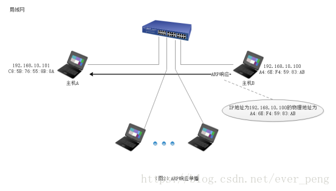
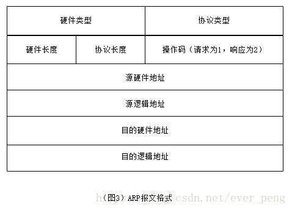
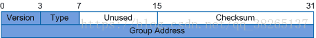
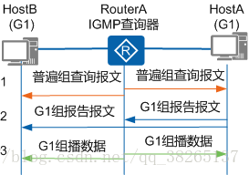
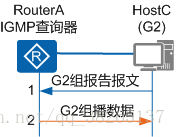
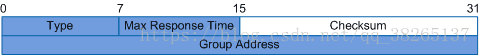
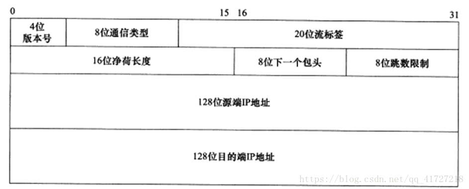

# 计算机网络

## 五层架构示意图

由下到上的顺序为：1、物理层；2、数据链路层；3、网络层；4、运输层（传输层）5、应用层

## 基本概念阐述

### 物理层

    在物理层上所传数据的单位是比特(bit)。发送方发送1或者0时，接收方应该接收相同的1或者0，因此物理层要考虑用多大的电压代表"1"或者"0", 以及接收方如何识别发送方所发出的比特。物理层还要确定连接电缆的插头应当有多少根引脚以及各引脚如何连接。当然解释比特代表的意思，就不是物理层的任务。请注意，传递信息所利用的一些物理媒体，如双绞线、同轴电缆、光缆、无线信道等，并不是物理层协议之内而是在物理层 协议的下面。因此也有人把物理层当做第0层。 

### 数据链路层

    数据链路层通常简称为链路层。我们知道，两台主机之间的数据传输，总是在一段一段的链路上传送的, 这就需要使用专门的链路层的协议。在两个相邻结点之间传送数据时，数据链路层量网络层交下来的IP数据报封装成帧(frameing),在两个相邻节点间的链路上传送帧, 每一帧包括数据和必要的控制信息(如同步信息、地址信息、差错信息等)。

    在接收数据时，控制信息使接收端能够知道一个帧从哪个比特开始到哪个比特结束，这样数据链路层在收到一个帧后，就可从中提取数据部分，上交到网络层。

    控制信息还能使接收端能够检测到所收到的帧中有无差错。如发现有差错，数据链路层就简单的丢弃了这个出了差错的帧，以免继续在网络传输下去白白的浪费资源。如果需要改正数据在数据链路层传输时出现的差错(这就是说,数据链路层不仅要检错,还要纠错)， 那么就可以采用可靠数据传输协议来纠正出现的差错。这种方法会使数据链路层的协议复杂些。

### 网络层

    网络层负责为分组交换网上的不同主机提供通信服务。

    在发送数据时，网络层吧运输层产生的报文段或者用户数据报封装成分组或者包进行传送。在TCP/IP体系中，由于网络层使用IP协议，因此分组也叫作IP数据报，或简称数据报。
    请注意：不要将运输层的"用户数据报UDP"和网络层的"IP数据报"弄混，此外，无论哪一层传输的数据单元，都可以笼统的用"分组"来表示。
    网络层的另一个任务就是选择合适的路由，是源主机运输层所传下来的分组，能够通过网络中的路由器来找到目的主机。

    互联网是有大量的异构(heterogeneous)网络来通过路由器(Router)相互连接起来的。互联网使用的网络层协议是无连接的网际协议IP(Internet Protocol)和许多路由选择协议, 因此互联网的网络层也叫作网际层或IP层。 

### 运输层

    运输层的任务就是负责向两台主机中进程之间的通信提供通用的数据传输服务。应用进程利用该服务穿上那个应用层报文。所谓通用的，是指并不针对某个特定网路应用，而是多种应用可以使用同一个运输层服务。由于一台主机可以同时运行多个进程，因此运输层有复用和分用的功能。复用就是多个应用层进程可同时使用下面运输层的服务，分用和复用相反，是运输层把收到的信息分别交付给上面应用层的相关进程。

    运输层主要有下面两种协议：

    传输控制协议TCP(Transmission Control Protocol)-提供面向连接的、可靠的数据传输服务，其数据传输的单位是报文段(segment)。
    用户数据报协议 UDP(User Datagram)。 Protocol)-提供无连接的、尽最大努力(best-effort)的数据传输服务(不保证数据传输的可靠性),其数据传输的单位是用户数据报。
    顺便指出，有人原意把运输层称为传输层，理由是这一层使用的TCP协议就叫做传输控制协议。从意思上看，传输和运输差别也不大，但OSI定义的第四层使用的是Transport，而不是Transmission。这两个字的含义还是有些差别。因此，使用运输层这个译名比较准确。

### 应用层

    应用层是体系结构中的最高层。应用层的任务是通过应用进程间的交互来完成特定网络应用。应用层协议定义的是应用进程间通信和交互的规则。这里的进程就是主机中正在运行的程序。对于不听的网络应用需要不有不同的应用层协议。在互联网的应用层协议很多，如域名DNS，支持万维网应用的HTTP协议，支持电子邮件的SMTP协议，等等。我们把应用层的数据单元称为报文(messgae)。

## 数据流程

根据箭头方向重点关注：1、主机1是发送方，主机2是接收方； 2、 数据在主机1内部自上而下，在每层都加上了本层的协议头部；而到了对端主机2 接收的时候，自下而上的剥离本层的头部；3、横向看每一层数据的格式基本是相同的。

## 相关协议

### ARP

    ARP协议是“Address Resolution Protocol”（地址解析协议）的缩写。其作用是在以太网环境中，数据的传输所依懒的是MAC地址而非IP地址，而将已知IP地址转换为MAC地址的工作是由ARP协议来完成的。

    在局域网中，网络中实际传输的是“帧”，帧里面是有目标主机的MAC地址的。在以太网中，一个主机和另一个主机进行直接通信，必须要知道目标主机的MAC地址。但这个目标MAC地址是如何获得的呢？它就是通过地址解析协议获得的。所谓“地址解析”就是主机在发送帧前将目标IP地址转换成目标MAC地址的过程。ARP协议的基本功能就是通过目标设备的IP地址，查询目标设备的MAC地址，以保证通信的顺利进行。

#### ARP映射方式

#### 静态映射

    静态映射的意思是要手动创建一张ARP表，把逻辑（IP）地址和物理地址关联起来。这个ARP表储存在网络中的每一台机器上。例如，知道其机器的IP地址但不知道其物理地址的机器就可以通过查ARP表找出对应的物理地址。这样做有一定的局限性，因为物理地址可能发生变化：
    （1）机器可能更换NIC（网络适配器），结果变成一个新的物理地址。
    （2）在某些局域网中，每当计算机加电时，他的物理地址都要改变一次。
    （3）移动电脑可以从一个物理网络转移到另一个物理网络，这样会时物理地址改变。
    要避免这些问题出现，必须定期维护更新ARP表，此类比较麻烦而且会影响网络性能。

#### 动态映射

    动态映射时，每次只要机器知道另一台机器的逻辑（IP）地址，就可以使用协议找出相对应的物理地址。已经设计出的实现了动态映射协议的有ARP和RARP两种。ARP把逻辑（IP）地址映射为物理地址。RARP把物理地址映射为逻辑（IP）地址。

#### ARP原理及流程

    在任何时候，一台主机有IP数据报文发送给另一台主机，它都要知道接收方的逻辑（IP）地址。但是IP地址必须封装成帧才能通过物理网络。这就意味着发送方必须有接收方的物理（MAC）地址，因此需要完成逻辑地址到物理地址的映射。而ARP协议可以接收来自IP协议的逻辑地址，将其映射为相应的物理地址，然后把物理地址递交给数据链路层。

#### ARP请求

    任何时候，当主机需要找出这个网络中的另一个主机的物理地址时，它就可以发送一个ARP请求报文，这个报文包好了发送方的MAC地址和IP地址以及接收方的IP地址。因为发送方不知道接收方的物理地址，所以这个查询分组会在网络层中进行广播。

.png)

#### ARP响应

    局域网中的每一台主机都会接受并处理这个ARP请求报文，然后进行验证，查看接收方的IP地址是不是自己的地址，只有验证成功的主机才会返回一个ARP响应报文，这个响应报文包含接收方的IP地址和物理地址。这个报文利用收到的ARP请求报文中的请求方物理地址以单播的方式直接发送给ARP请求报文的请求方。

#### 报文格式

    硬件类型：16位字段，用来定义运行ARP的网络类型。每个局域网基于其类型被指派一个整数。例如：以太网的类型为1。ARP可用在任何物理网络上。

    协议类型：16位字段，用来定义使用的协议。例如：对IPv4协议这个字段是0800。ARP可用于任何高层协议

    硬件长度：8位字段，用来定义物理地址的长度，以字节为单位。例如：对于以太网的值为6。

    协议长度：8位字段，用来定义逻辑地址的长度，以字节为单位。例如：对于IPv4协议的值为4。

    操作码：16位字段，用来定义报文的类型。已定义的分组类型有两种：ARP请求（1），ARP响应（2）。

    源硬件地址：这是一个可变长度字段，用来定义发送方的物理地址。例如：对于以太网这个字段的长度是6字节。

    源逻辑地址：这是一个可变长度字段，用来定义发送方的逻辑（IP）地址。例如：对于IP协议这个字段的长度是4字节。

    目的硬件地址：这是一个可变长度字段，用来定义目标的物理地址，例如，对以太网来说这个字段位6字节。对于ARP请求报文，这个字段为全0，因为发送方并不知道目标的硬件地址。

    目的逻辑地址：这是一个可变长度字段，用来定义目标的逻辑（IP）地址，对于IPv4协议这个字段的长度为4个字节。

#### ARP报文总长度

    ARP报文的总长度为64字节。

    首先要知道帧的概念 帧是在数据链路层传输的数据格式，比如以太网v2，以太网IEEE802.3和PPP等。

    所以Wireshark抓到的帧是包含帧头的，即包含以太网v2的帧头，长14 bytes；

    而ARP数据包的长度固定为28 bytes；

    帧总长度 = 帧头 + 网络层包头 + 传输层报文头 + 应用数据；

    而ARP请求中ARP包已经是最高层，之上没有传输层和应用层，所以总长度为：

    帧总长度 = 帧头 + ARP包头 = 14 + 28 = 42 bytes；

    而真正 发包的时为了保证以太网帧的最小帧长为64 bytes，会在报文里添加一个padding字段，用来填充数据包大小。

    使用wireshark抓包时，抓到的包为60 bytes。比以太网帧的最小帧长扫了4 bytes，原因是因为wireshark抓包时不能抓到数据包最后的CRC字段。

    CRC字段是为了校验以太网帧的正确性。在数据包填充完成后，回去通过算法计算一个值放到数据包的CRC字段中。当接受端收到数据包后，会同样使用算法计算一个值，然后和CRC字段的值进行对比，查看是否相同。如果不同则证明数据包被更改，如果相同则证明数据包并未被更改。

#### 报文封装

    ARP报文直接封装在数据链路帧中，例如，图4中，ARP分组被封装在以太网的帧中。注意，帧中的类型字段指出此帧所携带的数据是ARP报文。

### ICMP

    ICMP（Internet Control Message Protocol）网际控制报文协议。它是TCP/IP协议簇的一个子协议，用于在IP主机、路由器之间传递控制消息。控制消息是指网络通不通、主机是否可达、路由是否可用等网络本身的消息。这些控制消息虽然并不传输用户数据，但是对于用户数据的传递起着重要的作用。

    ICMP使用IP的基本支持，就像它是一个更高级别的协议，但是，ICMP实际上是IP的一个组成部分，必须由每个IP模块实现。

#### 简介

    ICMP协议是一种面向无连接的协议，用于传输出错报告控制信息。它是一个非常重要的协议，它对于网络安全具有极其重要的意义。它属于网络层协议，主要用于在主机与路由器之间传递控制信息，包括报告错误、交换受限控制和状态信息等。当遇到IP数据无法访问目标、IP路由器无法按当前的传输速率转发数据包等情况时，会自动发送ICMP消息。

    ICMP 是 TCP/IP 模型中网络层的重要成员，与 IP 协议、ARP 协议、RARP 协议及 IGMP 协议共同构成 TCP/IP 模型中的网络层。ping 和 tracert是两个常用网络管理命令，ping 用来测试网络可达性，tracert 用来显示到达目的主机的路径。ping和 tracert 都利用 ICMP 协议来实现网络功能，它们是把网络协议应用到日常网络管理的典型实例。 

    从技术角度来说，ICMP就是一个“错误侦测与回报机制”，其目的就是让我们能够检测网路的连线状况﹐也能确保连线的准确性。当路由器在处理一个数据包的过程中发生了意外，可以通过ICMP向数据包的源端报告有关事件。

    其功能主要有：侦测远端主机是否存在，建立及维护路由资料，重导资料传送路径（ICMP重定向），资料流量控制。ICMP在沟通之中，主要是透过不同的类别(Type)与代码(Code) 让机器来识别不同的连线状况。

    ICMP 是个非常有用的协议﹐尤其是当我们要对网路连接状况进行判断的时候。 

#### 工作原理

    ICMP提供一致易懂的出错报告信息。发送的出错报文返回到发送原数据的设备，因为只有发送设备才是出错报文的逻辑接受者。发送设备随后可根据ICMP报文确定发生错误的类型，并确定如何才能更好地重发失败的数据包。但是ICMP唯一的功能是报告问题而不是纠正错误，纠正错误的任务由发送方完成。

    我们在网络中经常会使用到ICMP协议，比如我们经常使用的用于检查网络通不通的Ping命令（Linux和Windows中均有），这个“Ping”的过程实际上就是ICMP协议工作的过程。还有其他的网络命令如跟踪路由的Tracert命令也是基于ICMP协议的。

#### ICMP报文格式

    ICMP报文包含在IP数据报中，属于IP的一个用户，IP头部就在ICMP报文的前面，所以一个ICMP报文包括IP头部、ICMP头部和ICMP报文，IP头部的Protocol值为1就说明这是一个ICMP报文，ICMP头部中的类型（Type）域用于说明ICMP报文的作用及格式，此外还有一个代码（Code）域用于详细说明某种ICMP报文的类型，所有数据都在ICMP头部后面。

    ICMP报文格式具体由RFC 777 ，RFC 792 规范。

#### ICMP类型

    已经定义的ICMP消息类型大约有10多种，每种ICMP数据类型都被封装在一个IP数据包中。主要的ICMP消息类型包括以下几种。

#### 响应请求

    我们日常使用最多的ping，就是响应请求（Type=8）和应答（Type=0），一台主机向一个节点发送一个Type=8的ICMP报文，如果途中没有异常（例如被路由器丢弃、目标不回应ICMP或传输失败），则目标返回Type=0的ICMP报文，说明这台主机存在，更详细的tracert通过计算ICMP报文通过的节点来确定主机与目标之间的网络距离。

    目标不可到达、源抑制和超时报文
    这三种报文的格式是一样的，目标不可到达报文（Type=3）在路由器或主机不能传递数据报时使用，例如我们要连接对方一个不存在的系统端口（端口号小于1024）时，将返回Type=3、Code=3的ICMP报文，它要告诉我们：“嘿，别连接了，我不在家的！”，常见的不可到达类型还有网络不可到达（Code=0）、主机不可到达（Code=1）、协议不可到达（Code=2）等。源抑制则充当一个控制流量的角色，它通知主机减少数据报流量，由于ICMP没有恢复传输的报文，所以只要停止该报文，主机就会逐渐恢复传输速率。最后，无连接方式网络的问题就是数据报会丢失，或者长时间在网络游荡而找不到目标，或者拥塞导致主机在规定时间内无法重组数据报分段，这时就要触发ICMP超时报文的产生。超时报文的代码域有两种取值：Code=0表示传输超时，Code=1表示重组分段超时。

#### 时间戳

    时间戳请求报文（Type=13）和时间戳应答报文（Type=14）用于测试两台主机之间数据报来回一次的传输时间。传输时，主机填充原始时间戳，接收方收到请求后填充接收时间戳后以Type=14的报文格式返回，发送方计算这个时间差。一些系统不响应这种报文。 

#### 全部消息类型

下表显示了完整的ICMP类型：

#### 应用

    ICMP 协议应用在许多网络管理命令中，下面以 ping 和 tracert 命令为例详细介绍 ICMP 协议的应用。

    （1） ping 命令使用 ICMP 回送请求和应答报文

    在网络可达性测试中使用的分组网间探测命令 ping 能产生 ICMP 回送请求和应答报文。目的主机收到 ICMP 回送请求报文后立刻回送应答报文，若源主机能收到 ICMP 回送应答报文，则说明到达该主机的网络正常。

    （2）路由分析诊断程序 tracert 使用了 ICMP时间超过报文

    tracert 命令主要用来显示数据包到达目的主机所经过的路径。通过执行一个 tracert 到对方主机的命令，返回数据包到达目的主机所经历的路径详细信息，并显示每个路径所消耗的时间。

### IGMP

#### IGMP 简介

    IGMP(Internet Group Management Protocol)互联网组管理协议是TCP/IP 协议族中负责IP组播成员管理的协议，用来在IP主机和与其直接相邻的组播路由器之间建立、维护组播组成员关系。

#### IGMP 工作机制

    到目前为止，IGMP 有三个版本：

    IGMPv1(由RFC 1112 定义)
    IGMPv2(由RFC 2236 定义)
    IGMPv3(由RFC 3376 定义)
    所有版本的IGMP 都支持ASM(Any-Source Multicast，任意信源组播)模型;IGMPv3 可以直接应用于SSM(Source-Specific Multicast，指定信源组播)模型，而IGMPv1 和IGMPv2 则需要在IGMP SSM Mapping 技术的支持下才能应用于SSM 模型。

#### IGMPv1 报文

    GMPv1包括两种类型的报文：

    普遍组查询报文（General Query）：查询器向共享网络上所有主机和路由器发送的查询报文，用于了解哪些组播组存在成员。
    成员报告报文（Report）：主机向查询器发送的报告报文，用于申请加入某个组播组或者应答查询报文。

#### IGMPv1工作机制

    IGMPv1协议主要基于查询和响应机制完成组播组管理。当一个网段内有多个组播路由器时，由于它们都可以接收到主机发送的成员报告报文，因此只需要选取其中一台组播路由器发送查询报文就足够了，该组播路由器称为IGMP查询器（Querier）。在IGMPv1中，由组播路由协议PIM选举出唯一的组播信息转发者（Assert Winner或DR）作为IGMPv1的查询器，负责该网段的组成员关系查询。

    IGMPv1的工作机制可以分为：普遍组查询和响应机制、新成员加入机制和组成员离开机制三个方面。

#### 普遍组查询和响应机制

    通过普遍组查询和响应，IGMP查询器可以了解到该网段内哪些组播组存在成员。

    如上图所示，普遍组查询和响应过程如下：

    1、IGMP查询器发送目的地址为224.0.0.1（表示同一网段内所有主机和路由器）的普遍组查询报文；收到该查询报文的组成员启动定时器。

    普遍组查询报文是周期性发送的，发送周期可以通过命令配置，缺省情况下每隔60秒发送一次。HostA和HostB是组播组G1的成员，则在本地启动定时器Timer-G1。缺省情况下，定时器的范围为0～10秒之间的随机值。

    2、第一个定时器超时的组成员发送针对该组的报告报文。

    假设HostA上的Timer-G1首先超时，HostA向该网段发送目的地址为G1的报告报文。也想加入组G1的HostB收到此报告报文，则停止定时器Timer-G1，不再发送针对G1的报告报文。这样报告报文被抑制，可以减少网段上的流量。

    3、IGMP查询器接收到HostA的报告报文后，了解到本网段内存在组播组G1的成员，则由组播路由协议生成（*，G1）组播转发表项，“ * ”代表任意组播源。网络中一旦有组播组G1的数据到达路由器，将向该网段转发。

#### 新组成员加入机制

    如上图所示，主机HostC加入组播组G2的过程如下：

    1、主机HostC不等待普遍组查询报文的到来，主动发送针对G2的报告报文以声明加入。
    2、IGMP查询器接收到HostC的报告报文后，了解到本网段内出现了组播组G2的成员，则生成组播转发项（*，G2）。网络中一旦有G2的数据到达路由器，将向该网段转发。

#### 组成员离开机制

    IGMPv1没有专门定义离开组的报文。主机离开组播组后，便不会再对普遍组查询报文做出回应。

    - 假设HostA想要退出组播组G1

    HostA收到IGMP查询器发送的普遍组查询报文时，不再发送针对G1的报告报文。由于网段内还存在G1组成员HostB，HostB会向IGMP查询器发送针对G1的报告报文，因此IGMP查询器感知不到HostA的离开。

    - 假设HostC想要退出组播组G2

    HostC收到IGMP查询器发送的普遍组查询报文时，不再发送针对G2的报告报文。由于网段内不存在组G2的其他成员，IGMP查询器不会收到G2组成员的报告报文，则在一定时间（缺省值为130秒）后，删除G2所对应的组播转发表项。

#### IGMPv2工作原理

    IGMPv2的工作机制与IGMPv1基本相同，最大的不同之处在于IGMPv2增加了离开组机制。成员主机离开组播组时，会主动发送成员离开报文通知IGMP查询器；IGMP查询器收到成员离开报文后，会连续发送特定组查询报文，询问该组播组是否还存在组成员。如果在一段时间内没有收到成员主机发送的报告报文，IGMP查询器将不再维护该组的组成员关系。IGMPv2可以使IGMP查询器及时了解到网段内哪些组播组已不存在成员，从而及时更新组成员关系，减少网络中冗余的组播流量。

#### IGMPv2报文

    与IGMPv1相比，IGMPv2的变化如下：

    - 除了普遍组查询报文和成员报告报文之外，IGMPv2新增了两种报文：
        - 成员离开报文（Leave）：成员离开组播组时主动向查询器发送的报文，用于宣告自己离开了某个组播组。
        - 特定组查询报文（Group-Specific Query）：查询器向共享网段内指定组播组发送的查询报文，用于查询该组播组是否存在成员。
    - IGMPv2对普遍组查询报文格式也做了改进，添加了最大响应时间（Max Response Time）字段。此字段取值可以通过命令配置，用于控制成员对于查询报文的响应速度。

#### 字段解释

1、Type：报文类型。该字段有以下四种取值：

    1、0x11:表示查询报文。IGMPv2的查询报文包括普遍组查询报文和特定组查询报文两类。
    2、0x12:表示IGMPv1成员报告报文。
    3、0x16:表示IGMPv2成员报告报文。
    4、0x17:表示成员离开报文。

2、Max Response Time：最大响应时间。

    成员主机在收到IGMP查询器发送的普遍组查询报文后，需要在最大响应时间内做出回应。该字段仅在IGMP查询报文中有效。

3、Group Address：组播组地址。

    1、在普遍组查询报文中，该字段设为0.0.0.0。
    2、在特定组查询报文中，该字段为要查询的组播组地址。
    3、在成员报告报文和离开报文中，该字段为成员要加入或离开的组播组地址。

#### IGMPv2工作机制

在工作机制上，与IGMPv1相比，IGMPv2增加了查询器选举和离开组机制。

#### 查询器选举机制

IGMPv2使用独立的查询器选举机制，当共享网段上存在多个组播路由器时，IP地址最小的路由器成为查询器。

    如上图所示，在IGMPv2中，查询器的选举过程如下：

    1、最初，所有运行IGMPv2的组播路由器（RouterA和RouterB）都认为自己是查询器，向本网段内的所有主机和组播路由器发送普遍组查询报文。

    RouterA和RouterB在收到对方发送的普遍组查询报文后，将报文的源IP地址与自己的接口地址作比较。通过比较，IP地址最小的组播路由器将成为查询器，其他组播路由器成为非查询器（Non-Querier）。
    
    2、此后，将由IGMP查询器（RouterA）向本网段内的所有主机和其他组播路由器发送普遍组查询报文，而非查询器（RouterB）则不再发送普遍组查询报文。

    非查询器（RouterB）上都会启动一个定时器（即其他查询器存在时间定时器Other Querier Present Timer）。在该定时器超时前，如果收到了来自查询器的查询报文，则重置该定时器；否则，就认为原查询器失效，并发起新的查询器选举过程。

#### 离开组机制

    如上图所示，在IGMPv2中，主机HostA离开组播组G1的过程如下：

    1、HostA向本地网段内的所有组播路由器（目的地址为224.0.0.2）发送针对组G1的离开报文。

    2、查询器收到离开报文，会发送针对组G1的特定组查询报文。发送间隔和发送次数可以通过命令配置，缺省情况下每隔1秒发送一次，共发送两次。同时查询器启动组成员关系定时器（Timer-Membership=发送间隔x发送次数）。

    3、该网段内还存在组G1的其他成员，这些成员在收到查询器发送的特定组查询报文后，会立即发送针对组G1的报告报文。查询器收到针对组G1的报告报文后将继续维护该组成员关系。

    如果该网段内不存在组G1的其他成员，查询器将不会收到针对组G1的报告报文。在Timer-Membership超时后，查询器将删除（*，G1）对应的IGMP组表项。当有组G1的组播数据到达查询器时，查询器将不会向下游转发。

#### IGMPv3工作原理

    IGMPv3主要是为了配合SSM（Source-Specific Multicast）模型发展起来的，提供了在报文中携带组播源信息的能力，即主机可以对组播源进行选择。

#### IGMPv3报文

与IGMPv2相比，IGMPv3报文的变化如下：

    - IGMPv3报文包含两大类：查询报文和成员报告报文。IGMPv3没有定义专门的成员离开报文，成员离开通过特定类型的报告报文来传达。
    - 查询报文中不仅包含普遍组查询报文和特定组查询报文，还新增了特定源组查询报文（Group-and-Source-Specific Query）。该报文由查询器向共享网段内特定组播组成员发送，用于查询该组成员是否愿意接收特定源发送的数据。特定源组查询通过在报文中携带一个或多个组播源地址来达到这一目的。
    - 成员报告报文不仅包含主机想要加入的组播组，而且包含主机想要接收来自哪些组播源的数据。IGMPv3增加了针对组播源的过滤模式（INCLUDE/EXCLUDE），将组播组与源列表之间的对应关系简单的表示为（G，INCLUDE，(S1、S2…)），表示只接收来自指定组播源S1、S2……发往组G的数据；或（G，EXCLUDE，(S1、S2…)），表示接收除了组播源S1、S2……之外的组播源发给组G的数据。当组播组与组播源列表的对应关系发生了变化，IGMPv3报告报文会将该关系变化存放于组记录（Group Record）字段，发送给IGMP查询器。
    - 在IGMPv3中一个成员报告报文可以携带多个组播组信息，而之前的版本一个成员报告只能携带一个组播组。这样在IGMPv3中报文数量大大减少。

#### IGMPv3查询报文格式

#### IGMPv3成员报告报文格式

字段解释：

- Record Type：组记录的类型。共分为三大类。
  - 当前状态报告。用于对查询报文进行响应，通告自己目前的状态，共两种：一种是MODE_IS_INCLUDE，表示接收源地址列表包含的源发往该组的组播数据。如果指定源地址列表为空，该报文无效；另一种是MODE_IS_EXCLUDE，表示不接收源地址列表包含的源发往该组的组播数据。
  - 过滤模式改变报告。当组和源的关系在INCLUDE和EXCLUDE之间切换时，会通告过滤模式发生变化，共两种：一种是CHANGE_TO_INCLUDE_MODE，表示过滤模式由EXCLUDE转换到INCLUDE，接收源地址列表包含的新组播源发往该组播组的数据。如果指定源地址列表为空，主机将离开组播组；另一种是CHANGE_TO_EXCLUDE_MODE，表示过滤模式由INCLUDE转换到EXCLUDE，拒绝源地址列表包含的新组播源发往该组的组播数据。
  - 源列表改变报告。当指定源发生改变时，会通告源列表发生变化，共两种：一种是ALLOW_NEW_SOURCES，表示在现有的基础上，需要接收源地址列表包含的组播源发往该组播组的组播数据。如果当前对应关系为INCLUDE，则向现有源列表中添加这些组播源；如果当前对应关系为EXCLUDE，则从现有阻塞源列表中删除这些组播源；另一种是BLOCK_OLD_SOURCES，表示在现有的基础上，不再接收源地址列表包含的组播源发往该组播组的组播数据。如果当前对应关系为INCLUDE，则从现有源列表中删除这些组播源；如果当前对应关系为EXCLUDE，则向现有源列表中添加这些组播源。
- Aux Data Len：辅助数据长度。在IGMPv3的报告报文中，不存在辅助数据字段，该字段设为0。
- Number of Sources：本记录中包含的源地址数量。
- Multicast Address：组播组地址。
- Sources Address：组播源地址。
- Auxiliary Data：辅助数据。预留给IGMP后续扩展或后续版本。在IGMPv3的报告报文中，不存在辅助数据。

#### IGMPv3工作机制

    在工作机制上，与IGMPv2相比，IGMPv3增加了主机对组播源的选择能力。

#### 特定组的加入

    IGMPv3的成员报告报文的目的地址为224.0.0.22（表示同一网段所有使能IGMPv3的路由器）。通过在报告报文中携带组记录，主机在加入组播组的同时，能够明确要求接收或不接收特定组播源发出的组播数据。

    如果Host和组播路由器之间运行的是IGMPv1或IGMPv2，Host加入组播组G时无法对组播源进行选择，无论其是否需要，都会同时接收到来自组播源S1和S2的数据。如果采用IGMPv3，成员主机可以选择仅接收S1组播数据。

    - 方法一：Host发送IGMPv3报告（G，INCLUDE，(S1)），仅接收源S1向组播组G发送的数据。
    - 方法二：Host发送IGMPv3报告（G，EXCLUDE，(S2)），不接收指定源S2向组播组G发送的数据，从而仅有来自S1的组播数据才能传递到Host。

#### 特定组查询

    当接收到组成员发送的改变组播组与源列表的对应关系的报告时（比如CHANGE_TO_INCLUDE_MODE、CHANGE_TO_EXCLUDE_MODE），IGMP查询器会发送特定源组查询报文。如果组成员希望接收其中任意一个源的组播数据，将反馈报告报文。IGMP查询器根据反馈的组成员报告更新该组对应的源列表。

#### IGMP各版本对比

    IGMPv1中定义了基本的组成员查询和报告过程，IGMPv2在此基础上添加了查询器选举和组成员离开的机制，IGMPv3中增加的主要功能是成员可以指定接收或指定不接收某些组播源的报文。三个版本在演进过程中对协议报文的处理是向前兼容的，因此尽管各个版本的协议报文格式不同，但是运行IGMP高版本的路由器可以识别低版本的IGMP报文。

    所有IGMP版本都支持ASM（Any-Source Multicast）模型。IGMPv3可以直接应用于SSM（Source-Specific Multicast）模型，而IGMPv1和IGMPv2则需要IGMP SSM Mapping技术的支持才可以应用于SSM模型。

### tcp

#### TCP 报文段的首部格式

TCP 虽然是面向字节流的，但 TCP 传送的数据单元却是报文段。一个 TCP 报文段分为首部和数据两部分。TCP 报文段首部的前20个字节是固定的，后面有4n字节是根据需要而增加的选项(n是整数)。因此 TCP 首部的最小长度是20字节

#### 首部字段

- 源端口和目的端口 各占2个字节，分别写入源端口号和目的端口号
- 序号 占4字节。序号范围是[0, 232-1]，共232(即4 294 967 296)个序号。序号增加到232-1后，下一个序号就又回到0。在一个 TCP 连接中传送的字节流中的每一个字节都按顺序编号
- 确认号 占4字节，是期望收到对方下一个报文段的第一个数据字节的序号
- 数据偏移 占4字节，它指出 TCP 报文段的数据起始处距离 TCP 报文段的起始处有多远。这个字段实际上是指出 TCP 报文段的首部长度
- 保留 占6位，保留为今后使用，但目前应置为0
- 下面有6个控制位，用来说明本报文段的性质

- 紧急 URG(URGent) 当 URG=1 时，表明紧急指针字段有效。它告诉系统此报文段中有紧急数据，应尽快传送(相当于高优先级的数据)，而不是按原先的排队顺序来传送
- 确认 ACK(ACKnowledgment) 仅当 ACK=1 时确认号字段才有效。当 ACK=0 时，确认号无效。TCP 规定，在连接建立后所有传送的报文段都必须把 ACK 置1
- 推送 PSH(Push) 当两个应用进程进行交互式的通信时，有时在一端的应用进程希望在键入一个命令后立即就能够收到对方的响应
- 复位 RST(ReSeT) 当 RST=1 时，表明 TCP 连接中出现严重差错(如由于主机崩溃或其他原因)，必须释放连接，然后再重新建立运输连接
- 同步 SYN(SYNnchronization) 在连接建立时用来同步序号。当 SYN=1 而 ACK=0 时，表明这是一个连接请求报文段。对方若同意建立连接，则应在响应的报文段中使 SYN=1 和 ACK=1
- 终止 FIN(FINis) 用来释放一个连接。当 FIN=1 时，表明此报文段的发送发的数据已发送完毕，并要求释放运输连接
- 窗口 占2字节。窗口值是[0, 216-1]之间的整数。窗口值作为接收方让发送方设置其发送窗口的依旧
- 检验和 占2字节。检验和字段检验的范围包括首部和数据这两部分
- 紧急指针 占2字节。紧急指针仅在 URG=1 时才有意义，它指出本报文段中的紧急数据的字节数
- 选项 长度可变，最长可达40字节

#### TCP 的连接建立

TCP 建立连接的过程叫做握手，握手需要在客户和服务器之间交换三个 TCP 报文段

1. 最初客户/服务器的 TCP 进程都处于 CLOSED(关闭)状态。在本实例中，A 主动打开连接，而 B 被动打开连接
2. B 的 TCP 服务器进程先创建传输控制块 TCB，并处于 LISTEN(收听) 状态，等待客户的连接请求
3. A 的 TCP 客户进程创建传输控制模块 TCB。并向 B 发出连接请求报文段，首部中的同部位 SYN = 1，选择一个初始序号 seq = x。TCP 客户端进程进入 SYN-SENT(同步已发送) 状态。TCP 规定，SYN 报文段(即 SYN = 1 的报文段)不能携带数据，但要消耗一个序号
4. B 收到连接请求报文段后，如同意建立连接，则向 A 发送确认。在确认报文段中应把 SYN 位和 ACK 位都置1，确认号是 ack = x + 1，同时也为自己选择一个初始序号 seq = y。这时 TCP 服务器进程进入 SYN-RCVD(同步收到) 状态。这个报文段也不能携带数据，但同样要消耗掉一个序号
5. TCP 客户进程收到 B 的确认后，还要向 B 给出确认。确认报文段的 ACK 置1，确认号 ack = y + 1，而自己的序号 seq = x + 1。TCP 的标准规定，ACK 报文段可以携带数据。但如果不携带数据则不消耗序号，在这种情况下，下一个数据报文段的序号仍是 seq = x + 1。这时，TCP 连接已经建立，A 进入 ESTABLISHED(已建立连接) 状态
6. 当 B 收到 A 的确认后，也进入 ESTABLISHED 状态

   传输控制块 TCB(Transmission Control Block)存储了每一个连接中的一些重要信息，如：TCP 连接表，指向发送和接收缓存的指针，指向重传队列的指针，当前的发送和接收序号等等

##### 异常情况

为什么 A 最后还要发送一次确认呢？这主要是为了防止已失效的连接请求报文段突然又传到了 B，因而产生错误

正常情况：A 发出连接请求，但因连接请求报文丢失而未收到确认。于是 A 再重传一次连接请求。后来收到了确认，建立了连接。数据传输完毕后，就释放了连接。A 共发送了两个连接请求报文段，其中第一个丢失，第二个到达了 B，没有“已失效的连接请求报文段”

异常情况：A 发出的第一个连接请求报文段并没有丢失，而是在某些网络结点长时间滞留了，以致延误到连接释放以后的某个时间才到达 B。本来这是一个早已失效的报文段。但 B 收到此失效的连接请求报文段后，就误认为是 A 又发出一次新的连接请求。于是就向 A 发出确认报文段，同意建立连接。假定不采用报文握手，那么只要 B 发出确认，新的连接就建立了。

现在 A 并没有发出建立连接的请求，因此不会理睬 B 的确认，也不会向 B 发送数据。但 B 却以为新的运输连接已经建立了，并一直等待 A 发来数据。B 的许多资源就这样被浪费了。
采用三报文握手的办法，可以防止上述现象的发生

#### TCP 的连接释放

1. A 的应用进程先向其 TCP 发出连接释放报文段，并停止再发送数据，主动关闭 TCP 连接。A 把连接释放报文段首部的终止控制位 FIN 置1，其序号 seq = u，它等于前面已传送过的数据的最后一个字节的序号加1。这时 A 进入 FIN-WAIT-1(终止等待1) 状态，等待 B 的确认。TCP 规定，FIN 报文段即使不携带数据，也消耗一个序号

2. B 收到连接释放报文段后即发出确认，确认号是 ack = u + 1，而这个报文段自己的序号是 v，等于 B 前面已传送过的数据的最后一个字节的序号加1。B随即进入 CLOSE-WAIT(关闭等待) 状态。TCP 服务器进程这时应通知高层应用进程，因而从 A 到 B 这个方向的连接就释放了，这时的 TCP 连接处于 半关闭(half-close) 状态，即 A 已经没有数据要发送了，但 B 若发送数据，A 仍要接收。也就是说，从 B 到 A 这个方向的连接并未关闭，这个状态可能会持续一段时间

3. A 收到来自 B 的确认后，就进入 FIN-WAIT-2(终止等待2) 状态，等待 B 发出的连接释放报文段

4. 若 B 已经没有要向 A 发送的数据，其应用进程就通知 TCP 释放连接。这时 B 发出的连接释放报文段必须使 FIN = 1。现假定 B 的序号为 w(在半关闭状态 B 可能又发送了一些数据)。B 还必须重复上次已发送过的确认号 ack = u + 1。这时 B 就进入 LAST-ACK(最后确认)状态，等待 A 的确认

5. A 在收到 B 的连接释放报文段后，必须对此发出确认。在确认报文段中把 ACK 置1，确认号 ack = w + 1，而自己的序号是 seq = u + 1(根据 TCP 标准，前面发送过的 FIN 报文段要消耗一个序号)。然后进入到 TIME-WAIT(时间等待)状态。此时 TCP 连接还没有释放掉。必须经过时间等待计时器(TIME-WAIT timer)设置的时间2MSL后，A 才进入到 CLOSED 状态

6. 当 A 撤销相应的传输控制块 TCB 后，就结束了这次的 TCP 连接

    时间 MSL 叫做最长报文段寿命(Maximum Segment Lifetime)，RFC 793建议设为2分钟。但这完全是从工程上来考虑的，对于现在的网络，MSL = 2分钟可能太长了一些

##### TIME-WAIT 等待时间

为什么 A 在 TIME-WAIT 状态必须等待 2MSL 的时间呢？

为了保证 A 发送的最后一个 ACK 报文段能够到达 B。这个 ACK 报文段有可能丢失，因而使处在 LAST-ACK 状态的 B 收不到对已发送的 FIN + ACK 报文段的确认。B 会超时 重传这个 FIN + ACK 报文段，而 A 就能在 2MSL 时间内收到这个重传的 FIN + ACK 报文段。接着 A 重传一次确认，重新启动 2MSL 计时器。最后，A 和 B 都正常进入到 CLOSED 状态。如果 A 在 TIME-WAIT 状态不等待一段时间，而是在发完 ACK 报文段后立即释放连接，那么就无法收到 B 重传的 FIN + ACK 报文段，因而也不会再发送一次确认报文段。这样，B 就无法安装正常步骤进入 CLOSED 状态

防止前面提到的“已失效的连接请求报文段”出现在本连接中。A 在发送完最后一个 ACK 报文段后，再经过时间 2MSL，就可以使本连接持续的时间内所产生的所有报文段都从网络中消失。这样就可以使下一个新的连接中不会出现这种旧的连接请求报文段

B 只要收到 A 发出的确认，就进入 CLOSED 状态。同样，B 在撤销相应的传输控制 TCB 后，就结束了这次的 TCP 连接。B 结束 TCP 连接的时间要比 A 早一些

保活计时器(keepalive timer)：服务器每收到一次客户的数据，就重新设置保活计时器，时间的设置通常是两小时。若两小时没有收到客户的数据，服务器就发送一个探测报文段，以后则每隔75秒发送一次。若一连发送10个探测报文段后仍无客户的响应，服务器就认为客户端出了故障，接着就关闭这个连接

##### TCP 的有限状态机

为了更清晰地看出 TCP 连接的各种状态之间的关系，下图为 TCP 的有限状态机。图中每一个方框即 TCP 可能具有的状态。每个方框中的大写英文字符串是 TCP 标准所使用的 TCP 连接状态名。状态之间的箭头表示可能发生的状态变迁。箭头旁边的字，表明引起这种变迁的原因，或表明发生状态变迁后又出现什么动作。请注意图中有三种不同的箭头。粗实线箭头表示对客户进程的正常变迁。粗虚线箭头表示对服务器进程的正常变迁。另一种细线箭头表示异常变迁

### IPv4

#### IPv4 报文格式

- 4位版本号指定IP协议的版本。对于IPv4来说，其值是4.其他IPv4的扩展版本（如SIP协议和PIP协议），则具有不同的版本号。

- 4位头部长度标识该IP头部有多少个32bit字（4字节）。因为4位最大能表示15，所以IP头部最长是60字节。

- 8位服务类型包括一个3位的优先权字段，4位的TOS字段和1位的保留字段（必须置0）。4位的TOS字段分别表示：最小延时，最大吞吐量，最高可靠性和最小费用。其中最多有一个能置位1，应用程序应该根据实际需要来设置它。比如像ssh和telnet这样的登陆程序需要的是最小延时服务，而文件传输程序ftp则需要最大吞吐量的服务。

- 16位总长度是指整个IP数据报的长度，以字节为单位，因此IP数据报的最大长度为65535字节。但由于MTU的限制，长度超过MTU的数据报都将被分片传输，所以实际传输的IP数据报的长度都远远没有达到最大值。

- 16位标识唯一地标识主机发送地每一个数据报。其初始值由系统随机生成，没发送一个数据报，其值就加1.该值在数据报分片时被复制到每个分片中，因此同一个数据报地所有分片都具有相同地标识。

- 3位标志字段地第一位保留。第二位表示"禁止分片"。如果设置了这个位，IP模块将不对数据报进行分片。在这种情况下，如果IP数据报长度超过MTU的话，IP模块将丢弃该数据报并返回一个ICMP差错报文。第三位表示“更多分片”。除了数据报的最后一个分片外，其他分片都要把它置1。

- 13位分片偏移是分片相对原始IP数据报开始处(仅指数据部分)的偏移。实际的偏移值是该值左移3位（乘8）后得到的。由于这个原因，除了最后一个IP分片外，每个IP分片的数据部分的长度必须是8的整数倍(这样才能保证后面的IP分片拥有一个合适的偏移量)。

- 8位生存时间(TTL)是数据报到达目的地之前允许经过的路由器跳数。TTL值被发送端设置(常见值位64)。数据报在转发过程中每经过一个路由，该值就被路由器减1。当TTL值减为0时，路由器将丢弃数据报，并向源端发送一个ICMP差错报文。TTL值可以防止数据报陷入路由循环。

- 8位协议用来区分上层协议，/etc/protocols文件定义了所有上层协议对应的protocol字段的数值。其中ICMP是1，TCP是6，UDP是17。

- 16位头部校验和由发送端填充，接收端对其使用CRC算法以检验IP数据报头部在传输过程中是否损坏。

- 32位的源端IP地址和目的端IP地址用来标识数据报的发送端和接收端。一般情况下，这两个地址在整个数据报的传递过程中保持不变，而不论它中间经过多少个中转路由器。

- IPv4最后一个选项字段是可变长的可选信息。这部分最多包含40个字节，因为IP头部最长是60字节（其中还包含前面讨论的20字节的固定部分）。可用的IP选项包括：
  1. 记录路由，告诉数据报途径的所有路由器都将自己的IP地址填入IP头部的选项部分，这样就可以跟踪数据报的传递路径。

  2. 时间戳，告诉每个路由器都将数据报被转发的时间填入IP头部的选项部分，这样就可以测量途径路由之间数据报传输时间。

  3. 松散源路由选择，指定一个路由器IP地址列表，数据报发送过程必须经过其中所有的路由器。

  4. 严格源路由选择，和松散源路由选择类似，不过数据报只能经过被指定的路由器。

#### IP 分片

当IP数据报的长度超过帧的MTU时，它将被分片传输。分片可能发生在发送端，也可能发生在中转路由器上，而且可能在传输过程中多次分片，但只有在最终的目标机器上，这些分片才会被内核中的IP模块重新组装。

IP头部中的如下三个字段给IP的分片和重组提供了足够的信息：数据报标识、标志和片偏移。一个IP数据报的每个分片都具有自己的IP头部，它们具有相同的标识值，但具有不同的片偏移。并且除了最后一个分片外，其他分片都将设置MF标志。此外，每个分片的IP头部的总长度字段将被设置位该分片的长度。

以太网帧的MTU时1500字节，因此它携带的IP数据报的数据部分最多是1480字节（IP头部占用20字节）。考虑用IP数据报封装一个长度为1481字节的ICMP报文（包括8字节的ICMP头部，所以其数据部分长度为1473字节），则该数据报在使用以太网帧传输时必须被分片，如下：

上图中，长度为1501字节的IP数据被拆分成两个IP分片，第一个IP分片长度为1500字节，第二个IP分片的长度为21个字节。每个IP分片都包含自己的IP头部（20字节），且第一个IP分片的IP头部设置了MF标志，而第二个IP分片的IP头部则没有设置该标志，因为它已经是最后一个分片了。原始IP数据报中的ICMP头部内容被完整地复制到了第一个IP分片中。第二个IP分片不包含ICMP头部信息，因为IP模块重组该ICMP报文地时候只需要一份ICMP头部信息，重复传送这个信息没有任何益处。1473字节地ICMP报文数据的前1472字节被IP模块复制到第一个IP分片中，使其总长度为1500字节，从而满足MTU的要求；而多出最后1字节则被复制到第二个IP分片中。

需要指出的是，ICMP报文的头部长度取决于报文的类型，其变化范围很大，上图以8字节为例。

### IPv6

IPv6协议是网络层技术发展的必然趋势。它不仅解决了IPv4地址不够用的问题，还做了很大的改进。比如，增加了多播和流的功能，为网络上多媒体内容的质量提供精细的控制；引入自动配置功能，使得局域网管理更方便；增加了专门的网络安全功能等

#### IPv6头部结构

- 4位版本号指定IP协议的版本。对IPv6来说，其值是6
- 8位通信类型指示数据流通信类型或优先级，和IPv4中的TOS类似
- 20位流标签是IPv6新增加的字段，用于某些对连接的服务质量有特殊要求的通信，比如音频或视频等实时传输的数据传输
- 16位净荷长度指的是IPv6扩展头部和应用程序长度之和，不包括固定头部长度。
- 8位下一个包头指出紧跟IPv6固定头部后的包头类型，如扩展头或某个上层协议头。它类似于IPv4头部中的协议字段，且相同的取值有相同的含义。
- 8位跳数限制和IPv4中的TTL含义相同
- IPv6用128来表示IP地址，使得IP地址的总量达到了2的128次方，足够使用。
- 32位表示的IPv4地址一般用点分十进制来表示，而IPv6地址则使用十六进制字符串表示，比如“FE80:0000:0000:0000:1234:5678:0000:0012”可见，IPv6地址用“：”分割成8组，每组包含2字节。但这种方法过于麻烦，通常可以使用所谓的零压缩法来将其简写，也就是省略连续的、全零的组，比如“FE80::1234:5678:0000:0012”。不过零压缩法对一个IPv6地址只能使用一次，比如上面的例子中，字节组“5678”后面的全零组就不能再省略，否则我们就无法计算每个“：：”之间省略了多少个全零组。

#### IPv6扩展头部

可变长的扩展头部使得IPv6能支持更多的选项，并且很便于将来的扩展需要。它的长度可以是0，表示数据报没有使用任何扩展头部。一个数据报可以包含多个扩展头部，每个扩展头部的类型由前一个头部中的下一个报头字段指定。目前可以使用的扩展头部如下：

### DHCP

#### DHCP的概念

1. DHCP：dynamic host configuration protocol

    是一种动态主机配置协议，基于UDP的应用层协议，协议的端口号是67(服务端) 和68(客户端)，其工作模式是C/S架构。
2. 工作的原理：

    在Server上提供地址池：提供一个/多个范围的IP地址----地址池是管理员定义的 client向server发起请求IP地址的报文，当server收到后，向client提供IP地址。

3. 工作的过程：

    (1)client 先去寻找网络中 可用的DHCP Server的位置;

    (2)Server 向clinet 回复 响应的信息;

    (3)client 向server 发起请求IP地址的报文;

    (4)Server 向client 提供IP地址、掩码、网关、DNS等相关配置的信息 client获取到这些信息，配置给自己的网卡;
    针对工作过程，存在以下四种报文：
    > dhcp discover  --->寻找网络中的Server  
dhcp offer   --->server 向 client 的响应、发送配置信息  
dhcp request   --->client 向 server请求IP地址等相关信息  
dhcp ack       --->server 向 client 发出回应

### IPoE认证

#### IPoE认证简介

IPoE系统包括基本的DHCP功能，同时扩展了网络中各个层面设备的能力。可以说IPoE不是简单的终端设备上支持DHCP就可以了，需要涉及到用户端，网络控制设备，网络业务系统等。

DHCP（ RFC-1541）本身是一种动态主机配置协议，最初主要针对于LAN应用。通过终端上的DHCP客户端，利用自动发现机制来尝试联系网络中的DHCP服务器。DHCP提供一系列IP配置参数，对用户端的IP层进行配置。 DHCP协议本身并没有用来认证的功能，但是DHCP可以配合其他技术实现认证，比如DHCP+web方式、DHCP+客户端方式和利用DHCP+OPTION扩展字段进行认证。所有这些方式都统称为DHCP+认证。本文讨论的主要是DHCP+OPTION扩展字段进行认证，又称为IPoE认证方式。用来作为DHCP扩展的OPTION字段主要为OPTION60 （RFC2132）和OPTION82 （RFC3046）。其中OPTION60中带有Vendor和Service Option信息，是由用户终端发起DHCP请求时携带的信息，网络设备只需要透传即可。其在应用中的作用是用来识别用户终端类型，从而识别用户业务类型，DHCP服务器可以依赖于此分配不同的业务IP地址。而OPTION82信息是由网络设备插入在终端发出的DHCP报文中，主要用来标识用户终端的接入位置，DHCP OPTION82信息可以由DHCP SNOOPING或DHCP RELAY设备进行插入。

IPoE认证系统各个部分功能如下：

1. IPoE 客户端部分  
    包括各种用户终端设备，产生DHCP消息，中间设备插入各种DHCP option进行用户绑定，业务绑定等。

2. IPoE 宽带网络网关控制设备（如BRAS或SR）  
    宽带网络网关控制设备（Broadband network gateway）进行DHCP消息到Radius认证消息的翻译。与Radius进行认证，授权，计费功能。认证通过后，下放Radius返回的每用户QoS，访问控制的列表等功能，同时对通过设备的流量/时长进行计费。

3. IPoE业务控制系统  
    包括Radius/DHCP/Diameter/Webportal等业务系统，能够动态调整每用户的带宽和QoS属性，针对预付费，流量，时长等提供多种计费手段。做到客户的可管理控制，可持续盈利，提供差异化的用户服务。

基于TR101定义的网络架构及WT146定义的IPoE Session 流程，网络边缘通过设置宽带业务网关-BNG(Broadband Network Gateway)设备来维护所有用户的 IP Session，通过 IPoE Session 对用户进行感知和控制，并实施各种用户策略（如QoS）。

#### IPoE认证特点总结

IPoE认证的主要特点总结如下：

- 基于上网用户的物理位置（通过唯一的VLAN ID/PVC ID标示）对用户进行认证和计费，用户上网时无需输入用户名和密码，这对于那些需要永远在线的用户，以及不愿意输入用户名和密码的特定用户是非常方便的 ,适合于在企业网，家庭简化硬件的配置工作。

- DHCP+ （option 60/option 82)对DHCP 协议进行了扩展，增加了安全，监控，用户识别等新的特性。

- 网络接入设备, 业务控制网关, DHCP server, Radius server 配合增强网络安全性（防DoS 攻击及地址仿冒）

- DHCP+ Radius 结合提供计费功能，使得DHCP 适合做运营.

- DHCP 是基于IP的在冗余保护方面比较有优势，能够实现真正的5个9的保护特性。

- 组播业务支持灵活

#### IPoE 认证的安全策略

由于IPoE认证本身不像PPPoE认证一样在网络层面提供唯一的点到点的通信， 所以运营商在部署时，安全问题是需要考虑的主要问题。随网络技术的发展，家庭网关，网络接入设备（如DSLAM）, 宽带网络网关必须协同工作，增强网络安全性。安全保证策略包括如下方面：

1. 反地址欺骗
    用户是通过DHCP/静态配置IP与MAC地址方式接入。业务控制网关自动生成一条IP和MAC地址帮定的Ingress方向的记录. 如果其它用户做防冒, IP地址相同，但是MAC地址不同，所有的数据包都会被丢弃。

2. 用户终端数限制  
    控制每个业务接入点所连接用户终端的数量。

3. 防DoS攻击  
    对于用户通过发送大量的DHCP请求，模拟不同MAC 地址的Host请求IP地址，攻击DHCP Server的情况：

    解决方式是DHCP 请求需要得到Radius 服务器认证通过才能被送到DHCP Server, Radius 设定了用户的MAC地址和线路号绑定的功能，只有IP地址和线路号在Radius数据库种才能获得许可申请用户的IP地址。

    对于由宽带网络网关发送大量的DHCP请求发送到Radius服务器的情况：

    解决方式是在用户认证通过认证获得IP地址之前，基于每个用户设置速率限制功能，设定每秒种只有1-2个DHCP数据包能够通过，降低对Radius Server的压力。对于Radius Server，对用户的攻击模式进行判断，对来自同一个DSLAM 线路号的Radius请求数量作控制，比方说在1秒内，最多只允许1个Radius请求，如果1分钟内连续出现多个Radius请求，则认证发生攻击，直接丢弃Radius数据包。

4. 业务隔离  
    下行通过VLAN隔离；上行方向除上网业务分配公网地址直接接入外，其它业务（包括网络管理）一律按业务类别分装在不同VPN内进行传送。

5. 非法组播源抑制  
    一般从DSLAM上行的端口都会将发送到组播组的数据过滤掉。在业务控制网关上与DSLAM 下行连接的端口上不会开启PIM协议，组播源不会从业务端口接入上来。

6. 端口隔离  
    设置用户水平分割组，禁止用户接入端口间直接转发。

### PPPOE认证

#### PPPoE 认证简介

PPPoE是利用以太网发送PPP包的传输方法和支持在同一以太网上建立多个PPP连接的接入技术。其结合了以太网和PPP连接的综合属性。以太网是一种广播网络，其缺点是通讯双方无法相互验证对方身份，通讯是不安全的。PPP协议提供了通讯双方身份验证的功能，但是PPP协议是一种点对点的协议，协议中没有提供地址信息。如果PPP应用在以太网上，必须使用PPPoE再进行一次封装，PPPoE协议提供了在以太网广播链路上进行点对点通信的能力。

PPP协议的一个重要的功能是提供了身份验证功能。PPP协议是一种点到点的链路层协议，它提供了点到点的一种封装、传递数据的一种方法。当一台主机希望启动一个PPPoE会话，它首先必须完成发现阶段，确定对端Server的以太网MAC地址，并建立一个唯一的PPPoE会话号（SESSION_ID）。PPP协议一般包括三个协商阶段：LCP（链路控制协议）阶段，认证阶段（比如CHAP/PAP），NCP（网络层控制协议，比如IPCP)阶段。拨号后，用户计算机和局方的接入服务器在LCP阶段协商底层链路参数，然后在认证阶段进行用户计算机将用户名和密码发送给接入服务器认证，接入服务器可以进行本地认证，可以通过RADIUS协议将用户名和密码发送给AAA服务器进行认证。认证通过后，在NCP（IPCP）协商阶段，接入服务器给用户计算机分配网络层参数如IP地址等。经过PPP的三个协商阶段后，用户就可以发送和接受网络报文，用户收发的所有网络层报文都封装在PPP报文中。

在PPP协议定义一个端对端关系时，发现阶段实际是一个客户与服务器的关系。在发现阶段，主机（客户端）搜寻并发现一个网络设备（服务器端）。在网络拓扑中，主机能与之通信的可能不只一个网络设备，但只能选择其中的一个。当发现阶段完成后，主机和网络设备将拥有建立PPPoE的所有信息。

PPPoE一般用面向于广大普通用户提供认证、计费服务，也可用于固定用户申请独用的一个公网IP地址。现网国内运营商主要是应用BRAS设备作为PPPoE的终结设备。

#### PPPoE 特点总结

PPPoE认证的主要优点总结如下：

- PPPoE认证的主要特点在于其应用广泛、成熟；而且标准性、互通性好；

- 与现有主流的PC操作系统可以良好的兼容，无兼容性问题；

- PPPoE通过唯一的Session-ID可以很好的保障用户的安全性；

- 因此，由于PPP会话的安全性、健壮性等特征，而被广泛应用于ADSL 接入认证。应用广泛，具有较好的市场基础。

PPPoE认证的不足之处在于认证机制比较复杂，对设备处理性能、内存资源需求较高；同时用户需要一个等待过程；同时随着多媒体业务发展， BRAS设备对于业务支持的局限性逐渐暴露出来，特别是组播支持方面，由于在PPP协议定义一个端对端关系时，在网络拓扑中，主机能与之通信的可能不只一个网络设备，但只能选择其中的一个，所以采用PPPOE方式认证时，组播复制点只能选择在BRAS设备上，而BRAS设备性能必将成为业务发展的瓶颈。同时由于传统BRAS设备在设计理念上不是满足多业务承载，所以设备在整机处理能力，可扩展性，可靠性等方面都将表现出不足。

### PPPoE 和IPoE技术讨论

下面对上述两种认证方式，进行一个综合的比较。

|功能|PPPoE|DHCP|
|---|---|---|
|认证效率|较低|很高|
|标准化程度|高 （RFC 2516）|高（WT146）|
|封装开销|大 （增加PPPoE 及PPP 封装）|小（MAC+IP)|
|客户端软件|需要|不需要
|用户认证|通过PAP、CHAP或者EAP触发|通过DHCP发现包触发
|认证服务器|Radius|Radius
|地址分配方式|IPCP,基于用户名和密码|DHCP,基于线路号、MAC地址.
|Session 建立过程|面向连接的Session-ID|无连接，用户通过IP地址标识
|用户在线检测|PPP keepalive包实现|UC-ARP方式或者DHCP-Renew方式
|安全性|高|高
|防地址仿冒能力|高（（唯一Session ID）|高（Anti-spoofing 策略）
|控制能力|端口/用户数/带宽|端口/用户数/带宽
|组播支持|组播控制点只能在业务控制层|组播控制点可选择在业务控制层或接入层
|精确计费|支持|支持

所有支持IP协议的设备都支持，不需要安装第三方拨号软件，可以广泛支持各种手持设备，移动设备，视频设备等。

- 报文开销  
    由于PPPoE报文引入了PPPoE头（6 bytes）和PPP头（2 bytes），所以在所有用户流量里面增加了8个字节的协议开销，对于高带宽的应用（4M以上的高清电视等），对于处理能力不高的终端设备，压力很大。

- 组播复制  
    由于PPPoE报文，是在BNG设备和用户之间建立点对点连接，中间的交换机层次不能很好的理解PPPoE报文格式，只能进行转发，无法进行针对VLAN等信息的有效的组播复制。所以采用PPPoE进行组播业务的开展，组播复制点只能是BNG设备，而采用IPoE，可以把组播复制点下移到DSLAM，一方面减少了BNG设备的压力，另一方面也极大的节约了网络接入层带宽。

- 用户冗余  
    IPoE，报文转发中，由于不需要接入PPPoE Session/Cookie信息，非常容易做到跨机箱的用户Session的保护，当一个机箱断电时，所有IPoE的状态信息被动态备份到另外一台设备，所以不需要用户进行重新拨号。而PPPoE由于转发过程中携带BNG生成的唯一的Session/Cookie信息，当一台设备断电时，另外一台设备无法获得全部的PPPoE状态，所以无法做到有效的跨机箱的用户冗余保护。

根据上述讨论，在终端支持、封装开销和组播支持认证效率等方面，IPoE认证具有较明显的优势，但由于IPoE比PPPoE来的简单，所以在安全性上会有一些新的隐患，比如私建DHCP，地址盗用等，需要用更多的精力来处理。
